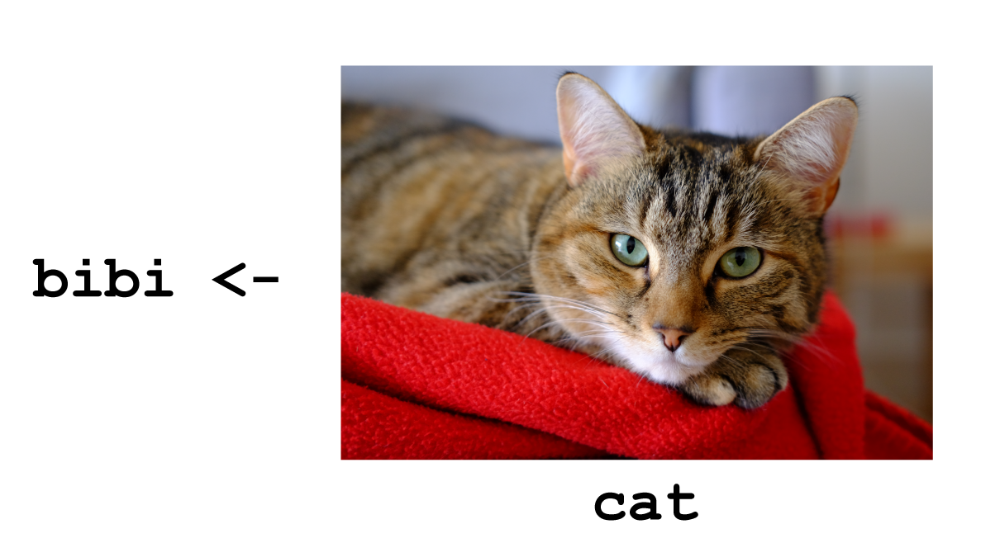

# Getting started in R and RStudio {#getting-started}

By the end of this chapter are you will:

+ understand how to install packages in RStudio.
+ know how to get help when you are stuck.
+ have set-up your first R project.
+ understand the atoms of R and how to use them to build data frames.
+ understand how to assign objects in R.
+ have created a plot using the `ggplot2` package.
+ have written outputs from R to files.

## Coding is for everyone

If, when faced with the thought of starting to learning to code you feel like the cat in Figure \@ref(fig:imposter).

(ref:imposter) [Imposter syndrome](https://bloggerbyresearch.files.wordpress.com/2015/04/a-baa-fail-cat-among-penguins.jpg).

```{r imposter, fig.cap='(ref:imposter)',fig.asp=1, out.width= '80%', fig.align='center', echo=FALSE,cache=TRUE}
knitr::include_graphics("img/a-baa-fail-cat-among-penguins.jpg")
```

Then hopefully by the end of these materials, you'll feel a bit more like the cat in Figure \@ref(fig:rcat).

(ref:r-cat) [R cat](https://stephensontam.files.wordpress.com/2017/06/lolcat-programmer.jpg)

```{r rcat, fig.cap='(ref:r-cat)',fig.asp=1, out.width= '80%', fig.align='center', echo=FALSE,cache=TRUE}
knitr::include_graphics("img/lolcat-programmer.jpg")
```

And if you like that, there is more at [R for cats](https://www.rforcats.net/).

## A little background and philosophy

***"There are only two kinds of languages: the ones people complain about and the ones nobody uses"***

*Bjarne Stroustrup, the inventor C++*

### What is R?

**R** is a programming language that follows the philosophy laid down by it's
predecessor S. The philosophy being that users begin in an interactive
environment where they don't consciously think of themselves as programming. 
It was created in 1993, and documented in [@ihaka1996].

Reasons R has become popular include that it is both open source and cross platform,
and that it has broad functionality, from the analysis of data and creating 
powerful graphical visualisations and web apps.

Like all languages though it has limitations, for example the syntax is initially
confusing.

Users and developers of R have in recent years sought to develop an inclusive 
and welcoming community which can found on twitter `#rstats` or 
through [RStudio Community](https://community.rstudio.com/). 
There are many useR groups, including groups seeking to promote diversity such
as [R-Ladies](https://rladies.org/about-us/): [Jumping Rivers maintains a list](https://jumpingrivers.github.io/meetingsR/).

### Why learn to code at all?

In terms of the philosophy of learning to code:

1. The primary motivation for using tools such as R is to get more done, in
less time and with less pain.

2. And the overall aim is to *understand and communicate* findings from our
data.

3. Additionally, as per [Greg Wilson's description of his motivation for teaching](http://third-bit.com/2019/01/30/why-i-teach.html), if we're going
to help make the world a better place, a bit of coding is likely to be
key tool in your kit.

(ref:pipeline) Data project workflow.

```{r pipeline, fig.cap='(ref:pipeline)',fig.asp=1, out.width= '80%', fig.align='center', echo=FALSE}
knitr::include_graphics("img/data_project_pipeline.png")
```

As shown in Figure \@ref(fig:pipeline) of typical data analysis workflow,
to achieve this aim we need to learn tools that enable us to perform the 
fundamental tasks of tasks of importing, tidying and 
often transforming the data. Transformation means for example, selecting a 
subset of the data to work with, or calculating the mean of a set of observations.

### A little goes a long way

Returning to our cat friend in Figure \@ref(fig:rcat), one doesn't need to be an expert programmer to find coding useful. As illustrated in Figure \@ref(fig:prac-prog)
there is a whole spectrum of code users from 
practitioners who are focused on applying some R to their specific problems, to those
programmers who develop the R language itself. In reality one may move
around on that spectrum as ones interests change over time.

(ref:pp) The Practitioner-Programmer spectrum

```{r prac-prog, fig.cap='(ref:pp)',fig.asp=1, out.width= '80%', fig.align='center', echo=FALSE}
knitr::include_graphics("img/practioner-programmer.png")
```

## RStudio {#rstudio}

Let's begin by learning about [RStudio](https://www.rstudio.com/), the
Integrated Development Environment (IDE).

**R is the language and RStudio is software created to facilitate our use of R.**
They are installed separately. You don't need RStudio to use R, but you do need
R to used RStudio.

We will use R Studio IDE to write code, navigate the files found on our computer,
inspect the variables we are going to create, and visualize the plots we will
generate. R Studio can also be used for other things (e.g., version control,
developing packages, writing Shiny apps) that we don't have time to cover during
this workshop.

R Studio is divided into "Panes", see Figure \@ref(fig:rstudio).

When you first open it, there are three panes,the console where you type 
commands, your environment/history (top-right), and your
files/plots/packages/help/viewer (bottom-right).

The environment shows all the R objects you have created or are using, such
as data you have imported.

The output pane can be used to view any plots you have created.

Not opened at first start up is the fourth default pane: the script editor pane, 
but this will open as soon as we create/edit a R script (or many other document types). 
*The script editor is where will be typing much of the time.*

(ref:rstudio) The RStudio Integrated Development Environment (IDE).

```{r rstudio,fig.cap='(ref:rstudio)',fig.asp=1, out.width= '80%', fig.align='center', echo=FALSE}
knitr::include_graphics("img/rstudio_ide_image.png")
```

The placement of these panes and their content can be customized (see menu, 
R Studio -> Tools -> Global Options -> Pane Layout). One of the advantages of 
using R Studio is that all the information you need to write code is available 
in a single window. Additionally, with many short-cuts, auto-completion, and 
highlighting for the major file types you use while developing in R, R Studio 
will make typing easier and less error-prone.

> RStudio has lots of keyboard short-cuts to make coding quicker and easier.
Try to find the menu listing all the keyboard short-cuts, including the short-cut
to find the menu!

Time for another philosophical diversion...

### What is real?

At the start, we might consider our environment "real" - that is to say the objects
we've created/loaded and are using are "real". But it's much better in the long run
to consider our scripts as "real" - our scripts are where we write down the code
that creates our objects that we'll be using in our environment.

**As a script is a document, it is reproducible**

Or to put it another way: we can easily recreate an environment from our scripts, 
but not so easily create a script from an environment.

To support this notion of thinking in terms of our scripts as real, we recommend
turning off the preservation of workspaces between sessions by setting the 
Tools > Global Options menu in R studio as shown in Figure \@ref(fig:workspace).

(ref:turn-off) Don't save your workspace, save your script instead.

```{r workspace, fig.cap='(ref:turn-off)',fig.asp=1, out.width= '80%', fig.align='center', echo=FALSE}
knitr::include_graphics("img/rdata_turn_off.png")
```

### Where am I?

R studio tells you where you are in terms of directory address as shown in Figure \@ref(fig:working-directory).

(ref:working-dir) Your working directory

```{r working-directory,fig.cap='(ref:working-dir)',fig.asp=1, out.width= '80%', fig.align='center', echo=FALSE}
knitr::include_graphics("img/rstudio_working_directory.png")
```

If you are unfamiliar with how computers structure folders and files, then 
consider a tree with a root from which the trunk extends and branches divide.
In the image above, the ~ symbol represents a contraction of the path from the
root to the 'home' directory (in Windows this is 'Documents') and then the 
forward slashes are the branches. (Note: Windows uses backslashes, Unix type 
systems and R use forward slashes).

It is good practice to keep a set of related data, analyses, and text
self-contained in a single folder, called **your working directory**. All of the
scripts within this folder can then use *relative paths* to files that indicate
where inside the project a file is located (as opposed to absolute paths, which
point to where a file is on a specific computer). An example
directory structure is illustrated in Figure \@ref(fig:dir-structure).
Working this way makes it a lot easier to move your project around on your computer.
Section \@ref(workflow) builds upon this to create a robust workflow for data analysis.

(ref:dir-structure) A typical directory structure

```{r dir-structure,fig.cap='(ref:dir-structure)',fig.asp=1, out.width= '80%', fig.align='center', echo=FALSE}
knitr::include_graphics("img/R-ecology-work_dir_structure.png")
```


### Getting help {#getting-help}

If you need help with a specific R function, let's say `barplot()`, you can type:

```{r barplot, eval=FALSE}
?barplot
```

A Google or internet search "R \<task\>" will often either send you to the appropriate package documentation or a helpful forum question that someone else already asked,
such as the [RStudio Community](https://community.rstudio.com/) or [Stack Overflow](http://stackoverflow.com/questions/tagged/r).

As well as knowing [where to ask](https://www.tidyverse.org/help/#where-to-ask), the key to get help 
from someone is for them to grasp your problem rapidly. You
should make it as easy as possible to pinpoint where the issue might be.

Try to use the correct words to describe your problem. For instance, a 
package is not the same thing as a library. Most people will understand 
what you meant, but others have really strong feelings about the difference
in meaning. The key point is that it can make things confusing for people 
trying to help you. Be as precise as possible when describing your problem.

If possible, try to reduce what doesn't work to a simple *reproducible
example* otherwise known as a *reprex*. 

For more information on how to write a reproducible example see 
[this article](https://www.tidyverse.org/help/#reprex) using the `reprex` package.


### Installing and loading packages {#install-packages}

Packages are collections of functions, and a function is a piece of code written
to perform a specific task, such as installing a package.

Therefore, the function `install.packages()` is a piece of code written to
perform the task of installing packages. We use it by typing `install.packages("tidyverse")`
with the name of the package in quotes inside the round brackets. Here
the package is `tidyverse`. Using the console
panel to type this and pressing `Enter` will run the function.

We of course need to know the name of the packages we are interested in.

Once a package is installed we need to load it into our environment to use it.
Loading packages is performed using the `library()` function. As with 
installation, we put the name of the package we want to load in between 
the round brackets like so `library(tidyverse)`. As before this can be done on 
the console, but we will usually load packages as part of script.
*Note that we don't need the quotes for the library function.*

> Try installing the `cowsay` package and loading it. It has one function
called `say()` that you can use to create messages with animals.

### Using functions {#functions-1}

As stated in \@ref(install-packages) a function is a piece of code written
to perform a specific task. Functions in R have the syntax of the name of the function
followed by round brackets. The round brackets are where we type the arguments 
that the function requires to carry out its task. For example, in \@ref(install-packages)
the function `install.packages()` requires the name of the package we want to 
install as arguments.

Many, if not most, functions can take more than one argument. The creators of the 
function should have given these defaults for the situation where the user provides
only one or some arguments. RStudio should prompt you for the arguments as you
type, but if you need to see what they are, use the help function `?` with the
function name in the Console and it will open the help panel or type the function 
name into the help panel search box.

For example, to find out all the arguments for `install.packages()` we'd
type `?install.packages` and press `Enter`.

> Try using `say()` to say "I are programmer" in the `cowsay` package and then 
find out what the arguments you can provide to make it produce different types of message.

## A project orientated workflow {#workflow}

This section is all about how to use R and RStudio to **"maximize effectiveness and reduce frustration."**

The above quote is from [Jenny Bryan's article](https://www.tidyverse.org/articles/2017/12/workflow-vs-script/) 
about a project orientated workflow.

The main point here is that how you do things, **the workflow**, should not be 
mixed up with the **product of the workflow** itself. 

The product being:

+ the raw data.
+ the code needed to produce the results from the raw data.

Ways in which you can mix workflow and product include having lines in your script
that set your working directory, or using RStudio to save your environment when
you are working.

**But why is this a problem?**

It's because **your computer isn't my computer** or **my laptop isn't my desktop**
or **I'm now using a Windows machine and I wrote the code two years ago on a Mac**.

By hard coding the directory into a script I have ensured my code will only run 
on the machine in which it was written. Chances are you will want to share your 
code with someone, either for publication or for them to check your work, or 
because you are working collaboratively and therefore we need to avoid mixing
workflow with product.

Likewise we can't share environments directly, but we can share the code that
creates the environment.

If we organise our analysis into self-contained projects that hold everything
needed to perform the analysis. These projects can be shared across machines and the analysis
recreated, and thus the workflow is kept separate from the product.

What does this look like in practice?

### RStudio Projects

Step one is to use an interactive development environment such as RStudio rather
than using R on its own for your analysis.

RStudio contains a facility to keep all files associated with a particular 
analysis together called, as you might expect from \@ref(workflow), a Project.

Creating a Project creates a file `.Rproj` containing all the information associated
with your analysis including the Project location (allowing you to quickly navigate to it),
and optionally preserves custom settings and open files to make it easier to resume work after a
break. This is also super helpful if you are working on multiple projects as you can
switch between them at a click.

(ref:r-project) Creating a R project

```{r r-projects,fig.cap='(ref:r-project)',fig.asp=1, out.width= '80%', fig.align='center', echo=FALSE}
knitr::include_graphics("img/rstudio_create_project.PNG")
```

Below, we will go through the steps for creating an `Project`:

* Start R Studio (presentation of R Studio -below- should happen here)
* Under the `File` menu, click on `New project`, choose `New directory`, then
  `Empty project`
* Enter a name for this new folder (or "directory", in computer science), and
  choose a convenient location for it. This will be your **working directory**
  for the rest of the day (e.g., `~/coding-together`)
* Click on "Create project"
* Under the `Files` tab on the right of the screen, click on `New Folder` and
  create a folder named `data` within your newly created working directory. (e.g., `~/data`)
* Create a R notebook (File > New File > R notebook) and save it in your working
  directory (e.g. `01-coding-together-workshop-02-05-2019.Rmd`)
* Or create a new R script (File > New File > R script) and save it in your working
  directory (e.g. `01-coding-together-workshop-02-05-2019.R`)
  
### R notebooks and R scripts

[R notebooks](https://bookdown.org/yihui/rmarkdown/notebook.html) combine writing 
text with R code in chunks. The R code chunks are indicated by three backticks and
a lowercase r in brackets: ` ```{r} ``` `.  Text can be formatted using
[markdown syntax](https://bookdown.org/yihui/rmarkdown/markdown-syntax.html). 
These are great for doing analysis
and report wrting at the same time.

R scripts are text files containing the commands that you would enter into the R
console. They are great for containing code you wish to call into another script
such as code for a function, or if you are submitting a script as job to run
on another computer without the need for RStudio.
  
### Level up with the `here` package  {#here}

This is a bit more tricky, so you might like to come back to `here` later, but 
Jenny Bryan loves the [`here`](https://here.r-lib.org/index.html) package by 
Kirill Müller so much [she wrote an ode to it](https://github.com/jennybc/here_here).

In a nutshell, the `here()` function sets the path implicitly to the top level of the R project
you are working in. **But what does that mean, and why should I care?**

Using the `here()` function like this:

`library(here)`

`here("data", "file_i_want.csv")`

where `"data"` is the folder containing  `"file_i_want.csv"`, the function works
out the rest of the path to the folder and file. This is useful if you open the 
project on different machines where the path is different. `here()` takes care of 
things, thus saving you some pain.

### Naming things {#names}
  
[Jenny Bryan](https://ropensci.org/blog/2017/12/08/rprofile-jenny-bryan/)
also has three principles for [naming things](http://www2.stat.duke.edu/~rcs46/lectures_2015/01-markdown-git/slides/naming-slides/naming-slides.pdf) 
that are well worth remembering.

When you names something, a file or an object, ideally it should be:
  
1. Machine readable (no white space, punctuation, upper AND lower-case...)
2. Human readable  (makes sense in 6 months or 2 years time)
3. Plays well with default ordering (numerical or date order)

We'll see examples of this as we go along.

## The tidyverse and tidy data

The [tidyverse](https://www.tidyverse.org/) [@R-tidyverse] is *"an opinionated 
collection of R packages designed for data science"* . 

Tidyverse packages contain functions that *"share an underlying design 
philosophy, grammar, and data structures."* It's this philosophy that makes 
tidyverse functions and packages relatively easy to learn and use.

Tidy data follows three principals for tabular data as proposed in the Tidy Data 
paper http://www.jstatsoft.org/v59/i10/paper :

1. Every variable has its own column.
2. Every observation has its own row.
3. Each value has its own cell.

We'll be using the tidyverse and learning more about tidy data as we go along.

## Atoms of R {#r-atoms}

Having set ourselves up in RStudio, let's turn our attention to the language of
R itself.

The basic building blocks of how R stores data are called atomic vector types. 
It's from these atoms that more complex structures are built. Atomic vectors
have one dimension, just like a single row or a single column in a spreadsheet.

The four main atoms of R are: 

+ Doubles: regular numbers, +ve or -ve and with or without decimal places. AKA numerics.
+ Integers: whole numbers, specified with an upper-case L, e.g. `int <- 2L`
+ Characters: Strings of text
+ Logicals: these store `TRUE`'s and `FALSE`'s' which are useful for comparisons.

(ref:atomic-vectors) The four most used atomic vectors, the building blocks of R

```{r atomic-vectors,fig.cap='(ref:atomic-vectors)',fig.asp=1, out.width= '50%', fig.align='center', echo=FALSE}
knitr::include_graphics("img/r-vectors-07-10-2018.png")
```


Let's make a character vector and check the atomic vector type, using the `typeof()`.
This also introduces a very important R function `c()`. This lower case c stands
for **combine**. So when we have several objects e.g. words or numbers, we can
combine them into a vector the length of the number of objects, as illustrated
here for a pack of cards:

```{r cards-characters}
cards <- c("ace", "king", "queen", "jack", "ten")

cards

typeof(cards)
```

Note here that we see the use of the assignment operator `<-` to assign our 
vector on the right as the object `cards`. We talk more about that in \@ref(assignment).

> Try creating a vector of numbers from 1 to 10 using the seq() function. Remember
to use ?seq if you want to learn more about the function.

## Assigning objects {#assignment}

Objects are just a way to store data inside the R environment. We assign labels to
objects using the assignment operator `<-`

```{r mass-kg}
mass_kg <- 55
```

Read this as *"mass_kg is assigned to value 55"* in your head. A subtle but important
point here is that the object is 55 and the value remains 55 regardless of the label we assign to it. In
fact we could assign more than one label to the same object. Another way to think 
about this is that Bibi is a cat, and remains a cat even if I call her Princess when
she refuses to go out in the rain.

(ref:bibi-cat) Bibi remains a cat even if I call her Princess when she refuses to go out in the rain.

```{r bibi-cat,fig.cap='(ref:bibi-cat)',fig.asp=1, out.width= '80%', fig.align='center', echo=FALSE}

```

Using `<-` can be annoying to type, so use RStudio’s keyboard short cut: 
Alt + - (the minus sign) to make life easier. 

Many people ask why we use this assignment operator when we can use `=` instead?

[Colin Fay had a Twitter thread on this subject](https://twitter.com/_colinfay/status/1006139974377443328),
but the reason I favour most is that it provides clarity. The arrow points in 
the direction of the assignment (it is actually possible to assign in the other
direction too) and it distinguishes between creating an object in the workspace 
and assigning a value inside a function.

Object name style is a matter of choice, but must start with a letter and can 
only contain letters, numbers, `_` and `.`. We recommend using descriptive names
and using `_` between words. Some special symbols cannot be used in variable 
names, so watch out for those.

So here we've used the name to indicate its value represents a mass in kilograms. 
Look in your environment pane and you'll see the `mass_kg` object 
containing the (data) value 55.

We can inspect an object by typing it's name:

```{r mass-inspect}
mass_kg
```

What's wrong here?

```{r mass-wrong-name, eval=FALSE}
mass_KG
```
`Error: object 'mass_KG' not found`

This error illustrates that typos matter, everything must be precise and `mass_KG`
is not the same as `mass_kg`. `mass_KG` doesn't exist, hence the error.

Let's use `seq()` to create a **seq**uence of numbers, and at the same time practice tab completion.

Start typing `se` in the console and you should see a list of functions appear,
add `q` to shorten the list, then use the up and down arrow to highlight the function
of interest `seq()` and hit Tab to select. This is tab completion.

RStudio puts the cursor between the parentheses to prompt us to enter some 
arguments. Here we'll use 1 as the start and 10 as the end:

```{r sequence-function}
seq(1,10)
```

If we left off a parentheses to close the function, then when we hit enter 
we'll see a `+` indicating RStudio is expecting further code. We either add the 
missing part or press Escape to cancel the code.

Let's call a function and make an assignment at the same time. Here we'll use
the base R function `seq()` which takes three arguments: `from`, `to` and `by`.

Read the following code as *"assign my_sequence to an object that stores a sequence of numbers from 2 to 20 by intervals of 2*.

```{r sequence-object}
my_sequence <- seq(2,20,2)
```

This time nothing was returned to the console, but we now have an object called
`my_sequence` in our environment.

### Indexing and subsetting

If we want to access and subset elements of `my_sequence` we use 
square brackets `[]` and the index number. Indexing in R starts at 1 such that 
1 is the index of the first element in the sequence, element 1 having the the value of 2.

For example element five would be subset by:

```{r sequence-element}
my_sequence[5]
```

Here the number five is the index of the vector, not the value of the fifth element. The value of the fifth element is 10. 

And returning multiple elements uses a colon `:`, like so

```{r sequence-range}
my_sequence[5:8]
```

## Lists, matrices and arrays

Lists also group data into one dimensional sets of data. The difference being 
that list group objects instead of individual values, such as several atomic 
vectors.

For example, let's make a list containing a vector of numbers and a character
vector

```{r list-example}
list_1 <- list(1:110,"R")

list_1
```

Note the double brackets to indicate the list elements, i.e. element one is the
vector of numbers and element two is a vector of a single character.

We won't be working with lists a great deal in these workshops, but they are a flexible way to 
store data of different types in R. 

Accessing list elements uses double square brackets syntax, for example
`list_1[[1]]` would return the first vector in our list. 

And to access the first element in the first vector would combine double and
single square brackets like so: `list_1[[1]][1]`.

Don't worry if you find this confusing, everyone does when they first start with
R. Hadley Wickham tweeted an image to illustrate list indexing shown in \@ref(fig:list-index).

(ref:list-index) List indexing by Hadley Wickham

```{r list-index, fig.cap='(ref:list-index)',out.width = '100%', echo=FALSE}
knitr::include_graphics("img/indexing.png")
```

Lists alongside `NULL` which indicates the absence of a vector, complete the set
of base vectors in R as illustrated in \@ref(fig:base-vectors).

(ref:base-vectors) The base vectors in R.

```{r base-vectors, fig.cap='(ref:base-vectors)',out.width='60%', echo=FALSE}
knitr::include_graphics("img/r-all-vectors-07-10-2018.png")
```

### Matrices and arrays

Matrices store values in a two dimensional array, whilst arrays can have n 
dimensions. We won't be using these either, but they are also valid R objects.

## Factors {#factors}

Factors are Rs way of storing categorical information such as eye colour or
car type. A factor is something that can only have certain values, and can be
ordered (such as `low`,`medium`,`high`) or unordered such as types of fruit.

Factors are useful as they code string variables such as "red" or "blue" to integer 
values e.g. 1 and 2, which can be used in statistical models and when plotting, 
but they are confusing as they look like strings. 

**Factors look like strings, but behave like integers.**

Historically R converts strings to factors when we load and create data, but 
it's often not what we want as a default. Fortunately, in the tidyverse strings
are not treated as factors by default.

## Data frames {#data-frames}

For data analysis in R, we mostly be using data frames.

Data frames are two dimensional versions of lists, and this is form of storing
data we are going to be using. In a data frame each atomic vector type becomes
a column, and a data frame is formed by columns of vectors of the same length.
Each column element must be of the same type, but the column types can vary.

Figure \@ref(fig:df) shows an example data frame we'll refer to as
saved as the object `df` consisting of three rows and three columns. Each 
column is a different atomic data type of the same length.

(ref:df) An example data frame `df`.


```{r df,fig.cap='(ref:df)', fig.asp=1, out.width= '80%', fig.align='center', echo=FALSE}
knitr::include_graphics("img/data_frame.png")
```

To create the data frame \@ref(fig:df) we can use the `data.frame()` function
in conjunction with the `c()` function to make the individual atomic vectors
that comprise the data frame as follows. Note that I am naming the vectors as I make
the data frame after the type of vector e.g. `numeric_vector = c(1,7,3)`. Also,
as this is a base R function I need to tell the function not to treat the character
strings as categorical data using `stringsAsFactors = FALSE`


```{r make-data-frame}
df <- data.frame(numeric_vector = c(1,7,3), 
                 character_vector = c("S","A","U"),
                 logical_vector = c(TRUE,FALSE,TRUE), 
                 stringsAsFactors = FALSE)

df
```

Packages in the  tidyverse create a modified form of data frame called a tibble.
You can read about tibbles [here](http://r4ds.had.co.nz/tibbles.html). One 
advantage of tibbles is that they don't default to treating strings as factors. 
We deal with transforming data frames in chapters \@ref(data-wrangle-1) and \@ref(data-wrangle-2).

Here's what the code to make the same data frame as before as a tibble looks like.
Note how we get more information from a tibble when it is returned to the Console,
it tells us what the dimensions are, and what type of vectors it contains.

```{r make-tibble}
df <- tibble(numeric_vector = c(1,7,3), 
                 character_vector = c("S","A","U"),
                 logical_vector = c(TRUE,FALSE,TRUE))

df
```

Sub-setting data frames can also be done with square bracket syntax, but as we
have both rows and columns, we need to provide index values for both row and 
column.

For example `df[1,2]` means **return the value of `df` row 1, column 2**. This corresponds with the value `A`. 

We can also use the colon operator to choose
several rows or columns, and by leaving the row or column blank we return all 
rows or all columns.

```{r subset-df, eval=FALSE}
# Subset rows 1 and 2 of column 1
df[1:2,1]

# Subset all rows of column 3
df[,3]
```

Don't worry too much about this for now, we won't be doing to much of this
in these lessons, but it's worth being aware of this syntax.

### Attributes 

An attribute is a piece of information you can attach to an object, such as
names or dimensions. Attributes such as dimensions are added when 
we create an object, but others such as names can be added.

Let's look at the `mpg` data frame dimensions:

```{r attributes}
# mpg has 234 rows (observations) and 11 columns (variables)
dim(mpg)
```

## Plotting data

One of the most useful and important parts of any data analysis is plotting 
data. We'll be spending a whole lesson on it in chapter \@ref(viz), but to 
give you an example, we'll use the `ggplot2` package as an introduction to 
automating a task in code, and as a tool for understanding data.

`ggplot2` implements the *grammar of graphics*, for describing
and building graphs. The idea being that we construct a plot in the following way:

1. Call the `ggplot()` function to create a graph.
2. Pass our data as the first argue to the `ggplot()` function.
3. Then pass some arguments to the aesthetics function `aes()` inside 
the `gpplot()` which tell ggplot how to plot the data e.g. which data goes on the x and y axis.
4. Then we follow the ggplot function with a `+` sign to indicate
we are going to add more code, followed by a geometric object function, a `geom`
which maps the data to type of plot we want to make e.g. a histogram or scatter plot.

Don't worry if this sounds confusing, it becomes clear with practice and all plots 
follow this grammar.

We'll use the `mpg` dataset that comes with the tidyverse to examine
the question *do cars with big engines use more fuel than cars with small engines?*

Try `?mpg` to learn more about the data.

1. Engine size in litres is in the `displ` column.
2. Fuel efficiency on the highway in miles per gallon is given in the `hwy` column.

To create a plot of engine size `displ` (x-axis) against fuel efficiency `hwy` 
(y-axis)  we do the following:

Now try extending this code to include to add a `colour` aesthetic to the
the `aes()` function, let `colour = class`, `class` being the vehicle type.
This should create a plot with as before but with the points coloured
according to the vehicle type to expand our understanding.

```{r, mpg-plot-2}
ggplot(data = mpg) + 
  geom_point(mapping = aes(x = displ, y = hwy, colour = class))
```

Now we can see that as we might expect, bigger cars such as SUVs tend to have 
bigger engines and are also less fuel efficient, but some smaller cars such as 
2-seaters also have big engines and greater fuel efficiency. Hence we have a 
more nuanced view with this additional aesthetic.

Check out the ggplot2 documentation for all the aesthetic possibilities (and 
Google for examples): http://ggplot2.tidyverse.org/reference/

So now we have re-usable code snippet for generating plots in R:

```{r, purl=FALSE,eval=FALSE}
ggplot(data = <DATA>) + 
  <GEOM_FUNCTION>(mapping = aes(<MAPPINGS>))
```

Concretely, in our first example `<DATA>` was `mpg`, the `<GEOM_FUNCTION>` 
was `geom_point()` and the arguments we supplies to map our aesthetics 
`<MAPPINGS>` were `x = displ, y = hwy`.

As we can use this code for any tidy data set, hopefully you are beginning to 
see how a small amount of code can do a lot.


## Exporting data

We'll spend more time on getting data in and out of our R environment in the 
next chapter \@ref(data-wrangle-2), but just to wrap this lesson up let's imagine
we wanted to export our plot and data for a colleague or presentation.

### readr

To export tibbles and data frames, we'll use the `readr` package, and the
`write_excel_csv()` function. This creates a table in comma separated variable
format that can opened by spreadsheet software such as excel. 

As it is a function
is has round brackets and the main arguments we pass are the object containing
the data we want to output and the name of the file and the location we want to
write the file to.

```{r write-data, eval=FALSE}
write_excel_csv(df, "outputs/example-data-02-05-2019.csv")
```

Here we are writing the `df` data frame as a csv file to the `outputs` folder
and a file called `example-data-02-05-2019.csv`.

### ggsave

If we want to save the last plot we made in `ggplot2` we can use the [`ggsave()`
function](https://ggplot2.tidyverse.org/reference/ggsave.html) 

We tell `ggsave()` the filename, and it will save it as that type depending
on how we name the file. For example if we use `file.pdf` it will save a PDF and
if we use `file.jpeg` it will save a `jpeg`.

Check out `?ggsave` or the line above for more options.

To save our last plot for example:

```{r ggsave, eval=FALSE}
ggsave("outputs/example-plot-02-05-2019.pdf")
```

### Exercise

> 1. Create a new project called 'coding-assessment-01'
2. Create two folders in this project: R and outputs
3. Create a R script using best naming practices i.e. name-date.R
4. In the script, write some comments at the top e.g. name, date, description
5. Create a tibble comprising of a character vector, a numeric vector
6. Install and load the `dslabs` package and create a density plot with ggplot2 using the
`heights` dataset, using the `x = height` variable and `fill = sex` to create a density plot
    ggplot(data = heights, aes(x =height, fill = sex)) + geom_density()
7. Save the plot as pdf and the tibble as csv file to the output folder.
    