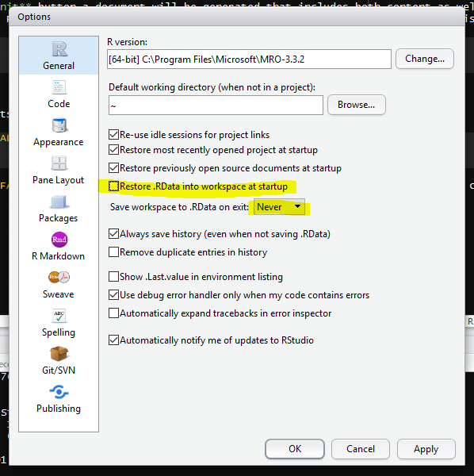

# Getting started in R and RStudio {#getting-started}

By the end of this chapter are you will:

+ understand how to install packages in RStudio.
+ know how to get help when you are stuck.
+ have set-up your first R project.
+ understand the atoms of R and how to use them to build data frames.
+ understand how to assign objects in R.
+ have created a plot using the `ggplot2` package.
+ have written outputs from R to files.

## Coding is for everyone

If, when faced with the thought of starting to learning to code you feel like this:

(ref:imposter) [Imposter syndrome](https://bloggerbyresearch.files.wordpress.com/2015/04/a-baa-fail-cat-among-penguins.jpg).

```{r imposter, fig.cap='(ref:imposter)',fig.asp=1, out.width= '80%', fig.align='center', echo=FALSE,cache=TRUE}
knitr::include_graphics(here("img/a-baa-fail-cat-among-penguins.jpg"))
```

Then hopefully by the end of these materials, you'll feel a bit more like this:

(ref:r-cat) [R cat](https://stephensontam.files.wordpress.com/2017/06/lolcat-programmer.jpg)

```{r rcat, fig.cap='(ref:r-cat)',fig.asp=1, out.width= '80%', fig.align='center', echo=FALSE,cache=TRUE}
knitr::include_graphics(here("img/lolcat-programmer.jpg"))
```

And if you like that, there is more at [R for cats](https://www.rforcats.net/).

## A little background and philosophy

***"There are only two kinds of languages: the ones people complain about and the ones nobody uses"***

*Bjarne Stroustrup, the inventor C++*

### What is R?

**R** is a programming language that follows the philosophy laid down by it's
predecessor S. The philosophy being that users begin in an interactive
environment where they don't consciously think of themselves as programming. 
It was created in 1993, and documented in [@ihaka1996].

Reasons R has become popular include that it is both open source and cross platform,
and that it has broad functionality, from the analysis of data and creating 
powerful graphical visualisations and web apps.

Like all languages though it has limitations, for example the syntax is initially
confusing.

Users and developers of R have in recent years sought to develop an inclusive 
and welcoming community which can found on twitter `#rstats` or 
through [RStudio Community](https://community.rstudio.com/). 
There are many useR groups, including groups seeking to promote diversity such
as [R-Ladies](https://rladies.org/about-us/): [Jumping Rivers maintains a list](https://jumpingrivers.github.io/meetingsR/).

### Why learn to code at all?

In terms of the philosophy of learning to code:

1. The primary motivation for using tools such as R is to get more done, in
less time and with less pain.

2. And the overall aim is to *understand and communicate* findings from our
data.

3. Additionally, as per [Greg Wilson's description of his motivation for teaching](http://third-bit.com/2019/01/30/why-i-teach.html), if we're going
to help make the world a better place, a bit of coding is likely to be
key tool in your kit.

(ref:pipeline) Data project workflow.

```{r pipeline, fig.cap='(ref:pipeline)',fig.asp=1, out.width= '80%', fig.align='center', echo=FALSE}
knitr::include_graphics("img/data_project_pipeline.png")
```

As shown in Figure \@ref(fig:pipeline) of typical data analysis workflow,
to acheive this aim we need to learn tools that enable us to perform the 
fundamental tasks of tasks of importing, tidying and 
often transforming the data. Transformation means for example, selecting a 
subset of the data to work with, or calculating the mean of a set of observations.

### A little goes a long way

Returning to our cat friend in Figure \@ref(fig:rcat), one doesn't need to be an expert programmer to find coding useful. As illustrated in Figure \@ref(fig:prac-prog)
there is a whole spectrum of code users from 
practioners who are focused on applying some R to their specific problems, to those
programmers who develop the R language itself. In reality one may move
around on that spectrum as ones interests change over time.

(ref:pp) The Practioner-Programmer spectrum

```{r prac-prog, fig.cap='(ref:pp)',fig.asp=1, out.width= '80%', fig.align='center', echo=FALSE}
knitr::include_graphics("img/practioner-programmer.png")
```

## RStudio {#rstudio}

Let's begin by learning about [RStudio](https://www.rstudio.com/), the
Integrated Development Environment (IDE).

**R is the language and RStudio is software created to facilitate our use of R.**
They are installed separately. You don't need RStudio to use R, but you do need
R to used RStudio.

We will use R Studio IDE to write code, navigate the files found on our computer,
inspect the variables we are going to create, and visualize the plots we will
generate. R Studio can also be used for other things (e.g., version control,
developing packages, writing Shiny apps) that we don't have time to cover during
this workshop.

R Studio is divided into "Panes", see Figure \@ref(fig:rstudio).

When you first open it, there are three panes,the console where you type 
commands, your environment/history (top-right), and your
files/plots/packages/help/viewer (bottom-right).

The enivronment shows all the R objects you have created or are using, such
as data you have imported.

The output pane can be used to view any plots you have created.

Not opened at first start up is the fourth default pane: the script editor pane, 
but this will open as soon as we create/edit a R script (or many other document types). 
*The script editor is where will be typing much of the time.*

(ref:rstudio) The Rstudio Integrated Development Environment (IDE).

```{r rstudio,fig.cap='(ref:rstudio)',fig.asp=1, out.width= '80%', fig.align='center', echo=FALSE}
knitr::include_graphics("img/rstudio_ide_image.png")
```

The placement of these panes and their content can be customized (see menu, 
R Studio -> Tools -> Global Options -> Pane Layout). One of the advantages of 
using R Studio is that all the information you need to write code is available 
ina single window. Additionally, with many shortcuts, auto-completion, and 
highlighting for the major file types you use while developing in R, R Studio 
will make typing easier and less error-prone.

Time for another philosphical diversion...

### What is real?

At the start, we might consider our environment "real" - that is to say the objects
we've created/loaded and are using are "real". But it's much better in the long run
to consider our scripts as "real" - our scripts are where we write down the code
that creates our objects that we'll be using in our environment.

**As a script is a document, it is reproducible**

Or to put it another way: we can easily recreate an environment from our scripts, 
but not so easily create a script from an enivronment.

To support this notion of thinking in terms of our scripts as real, we recommend
turning off the preservation of workspaces between sessions by setting the 
Tools > Global Options menu in R studio as shown in Figure \@ref(fig:workspace):

(ref:turn-off) Don't save your workspace, save your script instead.

```{r workspace, fig.cap='(ref:turn-off)',fig.asp=1, out.width= '80%', fig.align='center', echo=FALSE}

```

## Where am I?

R studio tells you where you are in terms of directory address like so:

(ref:working-dir) Your working directory

```{r working-directory,fig.cap='(ref:working-dir)',fig.asp=1, out.width= '80%', fig.align='center', echo=FALSE}
knitr::include_graphics("img/rstudio_working_directory.png")
```

If you are unfamiliar with how computers structure folders and files, then 
consider a tree with a root from which the trunk extends and branches divide.
In the image above, the ~ symbol represents a contraction of the path from the
root to the 'home' directory (in Windows this is 'Documents') and then the 
forward slashes are the branches. (Note: Windows uses backslashes, Unix type 
systems and R use forwardslashes).

It is good practice to keep a set of related data, analyses, and text
self-contained in a single folder, called the **working directory**. All of the
scripts within this folder can then use *relative paths* to files that indicate
where inside the project a file is located (as opposed to absolute paths, which
point to where a file is on a specific computer). Working this way makes it
a lot easier to move your project around on your computer and share it with
others without worrying about whether or not the underlying scripts will still
work.

(ref:dir-structure) A typical directory structure

```{r dir-structure,fig.cap='(ref:dir-structure)',fig.asp=1, out.width= '80%', fig.align='center', echo=FALSE}
knitr::include_graphics("img/R-ecology-work_dir_structure.png")
```


### Getting help

### Installing packages {#install-packages}

### Using functions {#functions-1}

## A project orientated workflow {#workflow}

[Jenny Bryan's article](https://www.tidyverse.org/articles/2017/12/workflow-vs-script/)

### RStudio Projects and `here` package

## Atoms of R

## Data frames

## Lists, matrices and arrays

## Plotting data

## Exporting data
