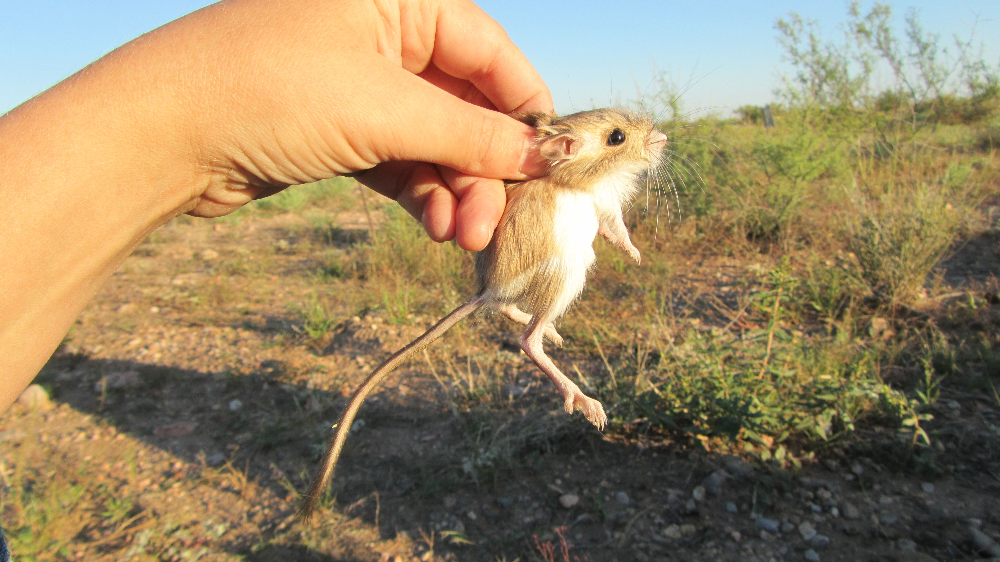
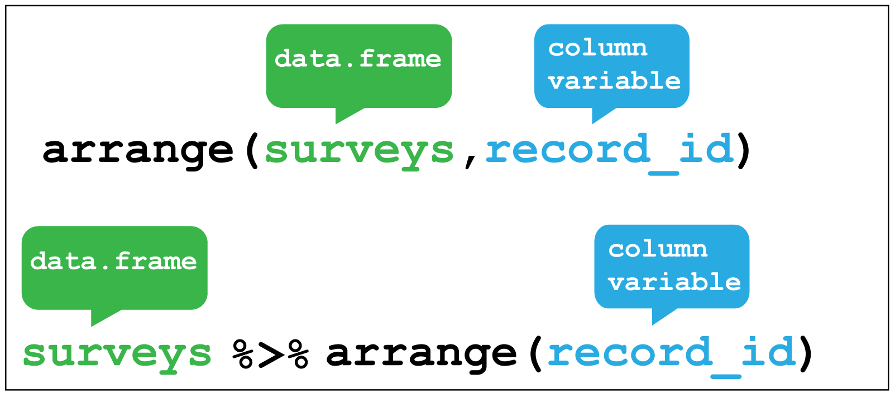
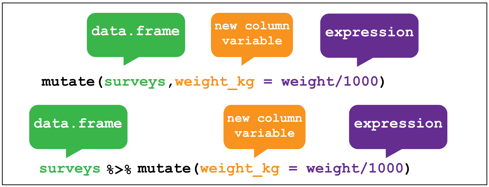

# Data wrangling I {#data-wrangle-1}

By the end of this chapter you will:

+ have learnt to load csv files
+ have used the key verbs of the `dplyr` package for transforming data to
arrange and filter observations, select variables, create new variables, and
create summaries.
+ have learnt how to combine functions with the pipe `%>%` from the `magrittr` package 
to combine tasks

The following sections are based upon the [data transformation chapter](https://r4ds.had.co.nz/transform.html) in R4DS and the 
[Data Carpentry ecology lesson](https://datacarpentry.org/R-ecology-lesson/index.html).

## Data organisation in spreadsheets

Karl Broman and Kara Woo wrote as 
paper all about [Data Organization in Spreadsheets](https://www.tandfonline.com/doi/full/10.1080/00031305.2017.1375989).

It's full of practical advice and context and well worth reading for helping
you think about best practices for organising your data for yourself, and when working with others. 

### Flat formats and Excel files

File formats like `.csv` and `.tsv`, comma separated variables and tab separated variables
respectively are plain text files. That is to 
say they contain only the data, as text information, and are the simplest and most 
convenient way to share data as most software can read and 
interpret them.

Excel files saves files into its own proprietary format `.xls` or `.xlsx` that holds 
information in addition to the data itself. For reading and
writing excel files in R, the tidyverse `readxl` package is very useful.

## The Portal Project data {#portal-project}

In this chapter we are going to focus on data from the [Portal Project](https://portal.weecology.org/),
which is a long running survey of rodents and other species in the Chihuahuan Desert,
as analysed in the 1994 paper by Heske et. al: 

**Long-Term Experimental Study of a Chihuahuan Desert Rodent Community: 13 Years 
of Competition**, DOI: 10.2307/1939547.

[A paper with details about the data and the project](https://www.biorxiv.org/content/10.1101/332783v1.full) is also available.

Specifically they explored the effect on the populations of small
seed eating rodents as a result of the exclusion of larger competitor kangaroo 
rats over a period from 1977 to 1991.

We'll also use some of their data to explore this question: **What is the effect 
of the exclusion of kangaroo rats from a plot of land on the granivore population?**

Figure \@ref(fig:k-rat) shows an image of one of the species of kangaroo rats excluded during the
study.

(ref:krat) [Merriam's kangaroo rat, Dipodomys merriami](https://portalproject.wordpress.com/)


```{r k-rat, fig.cap='(ref:krat)',fig.asp=1,out.width = '100%', fig.align='center', echo=FALSE,cache=TRUE}

```

Figure \@ref(fig:fence) indicates how the exclusion works, where a for number of
fenced plots the kangaroo rats were either able to enter by a hole or kept out.

(ref:fence) Kangaroo Rat exclusion

```{r fence,  fig.cap='(ref:fence)',fig.asp=1, out.width= '60%', fig.align='center', echo=FALSE,cache=TRUE}
knitr::include_graphics("img/fence_hole.JPG")
```

The plots are 50 metres by 50 metres, and a survey of the species within each
plot has been ongoing once a month for many years.

The dataset is stored as a comma separated value (CSV) file.
Each row holds information for a single animal, and the columns represent:

| Column           | Description                        | Type      |
|------------------|------------------------------------|-----------|
| record\_id       | Unique id for the observation      | numeric   |
| month            | month of observation               | numeric   |
| day              | day of observation                 | numeric   |
| year             | year of observation                | numeric   |
| plot\_id         | ID of a particular plot            | numeric   |
| species\_id      | 2-letter code                      | character |
| sex              | sex of animal ("M", "F")           | character |
| hindfoot\_length | length of the hindfoot in mm       | numeric   |
| weight           | weight of the animal in grams      | numeric   |
| genus            | genus of animal                    | character |
| species          | species of animal                  | character |
| taxa             | e.g. Rodent, Reptile, Bird, Rabbit | character |
| plot\_type       | type of plot                       | character |

The rodents species surveyed are:

**Kangaroo Rats**                                                     

| species_id | Scientific name       | Common name                  |
|------------|-----------------------|------------------------------|
| DM         | Dipodomys merriami    | Merriam's kangaroo rat       |
| DO         | Dipodomys ordii       | Ord's kangaroo rat           |
| DS         | Dipodomys spectabilis | Banner-tailed kangaroo rat   |

**Granivores**                                                        

| species_id | Scientific name           | Common name              |
|------------|---------------------------|--------------------------|
| PP         | Chaetodipus penicillatus  | Desert pocket mouse      |
| PF         | Perognathus flavus        | Silky pocket mouse       |
| PE         | Peromyscus eremicus       | Cactus mouse             |
| PM         | Peromyscus maniculatus    | Deer Mouse               |
| RM         | Reithrodontomys megalotis | Western harvest mouse    |

### Downloading and importing the data 

**First create a [R project](#workflow) for this analysis e.g `coding-together-week-2`**

The dataset is stored on-line, so we use the utility function 
`download.file()` to download the csv file to our data folder. 
(Did you create a data folder in the project directory?)

Here we pass the `url = ` and `destfile = ` arguments to `download.file()`.

As we have the `tidyverse` packages we can use the `readr` package it contains, 
which has many functions for reading files, including `read_csv()`.
The advantage of `read_csv()` over base R `read.csv()` is that it defaults to reading strings as
character vectors rather than factors (categorical variables) which 
is usually what we want.

As we read the data into our environment we need to assign a label 
to the object we are creating. Here we assign the dataset to an object 
called `surveys` using the `<-` assignment operator.

```{r download-portal-data, eval=FALSE}
# Download the data
download.file(url="https://ndownloader.figshare.com/files/2292169",
              destfile = "data/portal_data_joined.csv")

# Read into R as an object called surveys
surveys <- read_csv("data/portal_data_joined.csv")
```

## `dplyr`

[`dplyr`](https://dplyr.tidyverse.org/) *"is a grammar of data manipulation"*.
Concretely, it's a package of functions from the tidyverse that have been
created for tasks that require manipulation of data stored in [data frames](data-frames).

```{r dplyr-name, fig.cap="[Why is it called `dplyr`?](https://github.com/tidyverse/dplyr/issues/1857)",fig.asp=1, out.width= '100%', fig.align='center', echo=FALSE,cache=TRUE}
knitr::include_graphics("img/dplyr-name-github.png")
```


We're going to use the most common verbs in `dplyr` to examine the Portal Project
surveys data.

### Filter rows with `filter()`

The first verb to consider is the `filter()` function which enables us to subset observations
based on their value.

Consider the surveys data and sub-setting observations that only occurred from
1985 onwards. It's fairly natural to say *"filter the survey where the year
variable is equal or greater than 1985"*. And indeed this is how we use `filter()`
as a verb. 

Figure \@ref(fig:dplyr-filter) shows how 
we give the filter function two arguments. The first is the
data frame, the second is the variable and condition on which we wish to filter.

An alternative way to use `filter()` is to "pipe" the function using pipe `%>%` from the `magrittr` package 
which you can think of as using the word *"then"*. We take our data set *then* filter it. 
Using the pipe makes more sense when combining several operations.

> Ctl+Shift+M is a keyboard short cut to create a pipe.

For the filter itself, from R4DS:

*"To use filtering effectively, you have to know how to select the observations t
hat you want using the comparison operators. R provides the standard suite: `>`, 
`>=`, `<`, `<=`, `!=` (not equal), and `==` (equal)....For other types of combinations, 
you’ll need to use Boolean operators yourself: `&` is “and”, `|` is “or”, and `!` is “not”."*

See [Figure 5.1](https://r4ds.had.co.nz/transform.html#fig:bool-ops) in R4DS for
to see how these operators work.

(Note that we aren't assigning the output to an object here, so we can see it.)

(ref:filter) `dplyr::filter()`

```{r dplyr-filter, fig.cap='(ref:filter)',fig.asp=1, out.width= '100%', fig.align='center', echo=FALSE,cache=TRUE}

knitr::include_graphics("img/dplyr_filter.png")
```


```{r filter}
# Filter observations that only occurred from 1985 onwards
 filter(surveys, year >= 1985)
```

An example using Boolean logic, would be to use the "or" operator `|` to filter
for the observations only occurring on `plot_type`'s control or long term kangaroo 
rat exclusion. This time we assign the output to a new data frame called `surveys_filtered`.

**Note:** as `plot_type` is a character vector we put the terms in quotes,
and also the double equals sign `==` "for equal to".

```{r surveys-filtered}
# Keep only the rows corresponding with the Control and Long-term Krat Exclosure
surveys_filtered <- surveys %>% 
        filter(plot_type == "Control" | plot_type == "Long-term Krat Exclosure")
```

**Note:** `filter()` only includes rows where the condition is TRUE; it excludes both `FALSE` and missing `NA` values.
We have to explicitly ask to keep `NA` values using `is.na()` as an additional filter.

> How did I know which `plot_type`'s to filter? 
I used the `dplyr::distinct()` function, passing the `surveys` data frame
and the `plot_type` variable to obtain a list of the unique plot types, 
from which I determined the `Control` and `Long-term Krat Exclosure` plots
were the ones I was after. Note that you need to add the argument
`.keep_all = TRUE` to `distinct()` to return all the columns in the 
data frame

```{r distinct}
distinct(surveys, plot_type)
```


### Arrange rows with `arrange()`

The next verb is `arrange()` which also operates on the rows, and enables
you to arrange the observations in a data frame according to one or more variables.

As with `filter()` we supply the variable or variables of interest as the arguments
to `arrange()`.

From [R4DS](https://r4ds.had.co.nz/transform.html#arrange-rows-with-arrange): 

*"If you provide more than one column name, each additional column will be used to 
break ties in the values of preceding columns...
Missing values are always sorted at the end."*

Figure \@ref(fig:dplyr-arrange) shows how to arrange the observations according to the `record_id` 
variable.

(ref:arrange) `dplyr::arrange()`

```{r dplyr-arrange, fig.cap='(ref:arrange)',fig.asp=1, out.width= '100%', fig.align='center', echo=FALSE,cache=TRUE}

```

```{r arrange-record_id}
surveys %>% arrange(record_id)
```

Or we could use `arrange()` to find the record with the shortest hindfoot. 
*Note:* `arrange()` defaults to ascending order.

```{r arrange-short-foot}
surveys %>% arrange(hindfoot_length)
```

To find the Cactus Mouse, (`species_id == "PE"`) with the longest hindfoot we combine
`filter()` with `arrangee()` using the pipe:

*Hint* Use the `desc()` function to arrange from biggest to smallest.

```{r arrange-cactus-mouse}
surveys %>% 
        filter(species_id == "PE") %>% 
        arrange(desc(hindfoot_length))
```

### Select columns with `select()`

Often your data contains variables you don't need for the analysis you are performing, or you want to subset them to share with others.
To select only the ones you need, or explore subsets of the variables, the 
`select()` verb enables you to keep only the columns of interest.

Figure \@ref(fig:dplyr-select) shows the use of `select()` to choose only
the `year` and `plot_type` columns, with or without the pipe.

Selecting the variables contained in the columns can be done in various ways. 
For example, by the column number, the variable name or by range. 
Check the help function `?select` for more options.

(ref:select) `dplyr::select()`

```{r dplyr-select, fig.cap='(ref:select)',fig.asp=1, out.width= '100%', fig.align='center', echo=FALSE,cache=TRUE}
knitr::include_graphics("img/dplyr_select.png")
```

```{r select}
# Select the year and plot type columns
surveys %>% select(year,plot_type)
```

We can also use negative selection by adding a minus sign `-` to variables we
wish to discard. Here we discard `sex`,`hindfoot_length` and `weight` from the
`surveys_filtered` object and keep everything else:

```{r}
# Select everything except sex, hindfoot and weight
surveys_filtered %>% select(-sex,-hindfoot_length,-weight)
```


### Create new variables with `mutate()`

Another common task is to create a new variable or variables, often from existing data
within the data frame. For this we use the `mutate()` verb. It follows the 
same syntax as for `filter()`, `arrange()` and `select()` in that the first
argument is the dataset, and the subsequent arguments are the new variables we wish
to create.

Figure \@ref(fig:dplyr-mutate) shows how to create a new variable `weight_kg` by
dividing the existing `weight` variable in grams by 1000.

(ref:mutate) `dplyr::mutate()`

```{r dplyr-mutate, fig.cap='(ref:mutate)',fig.asp=1, out.width= '100%', fig.align='center', echo=FALSE,cache=TRUE}

```

A more complicated mutation, and key to to our analysis exploring the question
as to whether Kangaroo rats effect the size of the granivore population would
be to create a variable that indicates which type of rodent an observation is
recording.

To do this we can make use of another `dplyr` function called `case_when()`. 
This allows us to pass different values to our new `rodent_type` variable **if**
they match either `species_id` values corresponding with Kangaroo rats or Granivores.

To remind us, the rodents species surveyed are:

**Kangaroo Rats**                                                     

| species_id | Scientific name       | Common name                  |
|------------|-----------------------|------------------------------|
| DM         | Dipodomys merriami    | Merriam's kangaroo rat       |
| DO         | Dipodomys ordii       | Ord's kangaroo rat           |
| DS         | Dipodomys spectabilis | Banner-tailed kangaroo rat   |

**Granivores**                                                        

| species_id | Scientific name           | Common name              |
|------------|---------------------------|--------------------------|
| PP         | Chaetodipus penicillatus  | Desert pocket mouse      |
| PF         | Perognathus flavus        | Silky pocket mouse       |
| PE         | Peromyscus eremicus       | Cactus mouse             |
| PM         | Peromyscus maniculatus    | Deer Mouse               |
| RM         | Reithrodontomys megalotis | Western harvest mouse    |

The first argument to `case_when()` is the variable and value we want to match,
just like `filter()`, for example `species_id == "DM"`, and then we use the tilde
operator `~` followed by the value we want give our new variable **if** a we match
this condition. Here we want our new variable `rodent_type` to be "Kangaroo Rat".

We do this for every case we want to match. There are other species than rodents 
in this data, and we have choice to either provide values for each one, ignore them
which will lead to the value `NA` for those rows or we can supply a single value 
to the rest by giving the argument `TRUE` followed by the value. This means if
there are other values in `species_id` - if this is true - then give them all the
same value. Here we supply the value "Other" for the remaining species: `TRUE ~ "Other"`.

Below is how this looks in practice and is assigned to a new `surveys_mutated` object.

```{r}
# Mutate surveys_filtered
surveys_mutated <- surveys_filtered %>%
  # Create rodent type variable for K-rats and Granivores.Everything else, Other.
  mutate(rodent_type = case_when(
         species_id == "DM" ~ "Kangaroo Rat",
         species_id == "DO" ~ "Kangaroo Rat",
         species_id == "DS" ~ "Kangaroo Rat",
         species_id == "PP" ~ "Granivore",
         species_id == "PF" ~ "Granivore",
         species_id == "PE" ~ "Granivore",
         species_id == "PM" ~ "Granivore",
         species_id == "RM" ~ "Granivore",
         TRUE ~ "Other"))

# Check output using distinct()
surveys_mutated %>% select(species_id,rodent_type) %>% 
        distinct(species_id, .keep_all = T)
```


### Grouped summaries with `group_by()` and `summarise()`

Finally we'll look at the verb `summarise()` and it's companion `group_by()`. 

`summarise()` collapses a data frame
into a single row. For example as shown in Figure \@ref(fig:dplyr-summarise), we 
could use it to find the average weight
of all the animals surveyed in the original data frame using `mean()`. (Here the
`na.rm = TRUE` argument is given to remove missing values from the data, 
otherwise R would return `NA` when trying to average.)

(ref:summarise) `dplyr::summarise()`

(ref:group-by) `dplyr::group_by()`

```{r dplyr-summarise, fig.cap='(ref:summarise)',out.width = '100%', fig.align='center', echo=FALSE,cache=TRUE}
knitr::include_graphics("img/dplyr-summarise-16-10-2019.png")
```

```{r summarise}
surveys %>%
  summarize(mean_weight = mean(weight, na.rm = TRUE))
```

However `summarise()` is most useful when paired with `group_by()`
which defines the variables upon which we operate upon. 

Figure \@ref(fig:group-by) shows how by grouping the observations according to the
`sex` and `species_id` variables, we can then calculate the `mean_weight` for 
each of these groups.


```{r group-by, fig.cap='(ref:group-by)',fig.align='center',out.width = '100%', echo=FALSE,cache=TRUE}
knitr::include_graphics("img/dplyr-group-by-16-10-2019.png")
```

Using `group_by()` with `summarise()` now returns a table with 92 rows instead of single row.

```{r grouped-summarise,  cache=TRUE}
surveys %>%
  group_by(sex, species_id) %>%
  summarize(mean_weight = mean(weight, na.rm = TRUE))
```

## Using `dpylr` to explore the effect of Kangaroo Rat exclusion on Granivore populations

Let's use what we've learnt so far to explore the effect of Kangaroo Rats on Granivore populations
for the entire time covered in the `surveys` dataset. 

A line plot with time on the x-axis and number of rodents on the y-axis would be
one way to visual this, comparing the observations between the control plots and the Kangaroo
rat exclusion plots.

One way to do this is to:

1. `filter()` the observations for the control and exclusion plots.
2.  Create a new `rodent_type` variable for Kangaroo Rats and Granivores.
3.  Create a new variable for time from the existing `day`,`month` and `year` variables.
4.  Group the data according to the `rodent_type`, `plot_type` our time variable, and use `summarise()` to calculate the number of observations for each group. 

### Re-cap of `filter()` and `mutate()`

Let's re-cap steps one and two:

```{r surveys-recap, eval=FALSE}
# Keep only the rows corresponding with the Control and Long-term Krat Exclosure
surveys_filtered <- surveys %>% 
        filter(plot_type == "Control" | plot_type == "Long-term Krat Exclosure")

# Mutate surveys_filtered
surveys_mutated <- surveys_filtered %>%
  # Create rodent type variable for K-rats and Granivores.Everything else, Other.
  mutate(rodent_type = case_when(
         species_id == "DM" ~ "Kangaroo Rat",
         species_id == "DO" ~ "Kangaroo Rat",
         species_id == "DS" ~ "Kangaroo Rat",
         species_id == "PP" ~ "Granivore",
         species_id == "PF" ~ "Granivore",
         species_id == "PE" ~ "Granivore",
         species_id == "PM" ~ "Granivore",
         species_id == "RM" ~ "Granivore",
         TRUE ~ "Other"))
```

### Use `lubridate` to create new time variables

Step three introduces the tidyverse [`lubridate` package](https://lubridate.tidyverse.org/). 
As the name suggests, this is a package for wrangling dates and times.

It would be clearer to plot the data on three month (quarterly) basis rather than
plotting every date in the dataset, so we need to create a variable that contains
the quarter in which the observation was made, for each observation.

From `lubridate` we will use the function `make_date()` in combination with `mutate()` 
first to create a single column `date` variable from the `day`,`month` and `year` variables. 
We then use this `date` variable to create another new variable containing a value for the 
quarter of the year in which the observation was made `quarter` using the `quarter()` function.

We'll assign this output to a new data frame called `surveys_subset`.

```{r lubridate-mutate, message=FALSE, warning=FALSE,  cache=TRUE}
library(lubridate)
surveys_subset <- surveys_mutated %>% 
        mutate(date = make_date(day = day, month = month, year = year), 
               quarter = quarter(date,with_year = TRUE))
```

### Group and summarise the data into quarterly observations

Step four is to group and summarise our quarterly observations. 

We group by `rodent_type`, `plot_type` and
`quarter` variables. In other words we've grouped the data according to Kangaroo Rat or
Granivore, Control plot or Exclusion plot, and the quarter of the year in which 
the observation occurred. 

Then we can calculate the number of captures for each of these groups by
using `summarise()` to create a `mean_captures` variable which is equal to the number
of rows for that group using the `n()` function divided by 4 to calculate
the average over each quarter.

**Note:** `n()` is a `dplyr` function that returns the number of observations in the current group.

```{r by-quarter,  cache=TRUE}
by_quarter <- surveys_subset %>% 
        group_by(rodent_type,plot_type,quarter) %>% 
        summarise(mean_captures = n()/4)

by_quarter
```

These steps have taken us from a table of 34,786 observations to a table of 567 observations.

### Create a plot with `ggplot` 

Now we can create a line and point plot, using the `by_quarter` data as our first `ggplot()` 
argument. 

For the aesthetics we are plotting the time on the
x-axis using the `quarter` variable, and the quarterly `mean_captures` on the
y-axis, and we colour the data by `rodent_type`.

Then we create line and point geometric mappings, and split the plot into two
facets using `facet_wrap` according to `plot_type`.

```{r plot-quarter-all,out.width = '100%', cache=TRUE}
ggplot(by_quarter,
       aes(x=quarter,y=mean_captures,colour=rodent_type)) +
  geom_line() +
  geom_point() +
  facet_wrap(~ plot_type)
```

But it would be more useful to only plot the Kangaroo Rats and Granivores
data, so let's filter out the other species. And move the legend to the bottom
of the plot and add a title.

```{r plot-quarter, out.width = '100%',cache=TRUE}
by_quarter %>% 
        filter(rodent_type != "Other") %>% 
        ggplot(aes(x=quarter,y=mean_captures,colour=rodent_type)) +
  geom_line() +
  geom_point() +
  facet_wrap(~ plot_type) +
        theme(legend.position = "bottom") +
        ggtitle("How does excluding Kangaroo Rats 
                effect Granivore populations?", 
                subtitle = "Mean quarterly observations")
```

> **Challenge** Can you do a similar analysis, but plotting the data only from 1980 to 2000 and by semester?