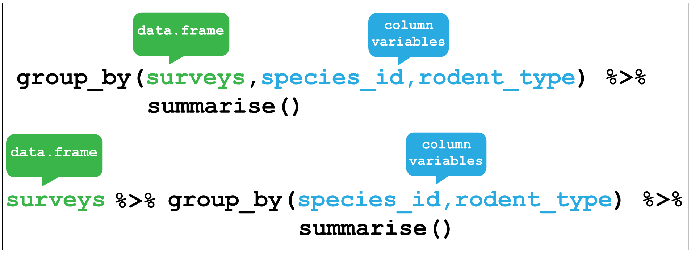

# Data wrangling I {#data-wrangle-1}

By the end of this chapter you will:

+ have learnt to load and export csv and excel files
+ know what tidy data is and how to organise data such that it is tidy 
+ have used the key verbs of the `dplyr` package for transforming data to
arrange and filter observations, select variables, create new variables, and
create summaries.
+ have learnt how to combine functions with the pipe from the `magrittr` package 
to combine tasks

The following sections are based upon the [data transformation chapter](https://r4ds.had.co.nz/transform.html) in R4DS and the 
[Data Carpentry ecology lesson](https://datacarpentry.org/R-ecology-lesson/index.html).

## Organising data in spreadsheets

### tidy data revisited

## Loading data

### Flat formats

### Excel files


## The Portal Project data

In this chapter we are going to focus on data analysed 
in the 1994 paper by Heske et. al: 

**Long-Term Experimental Study of a Chihuahuan Desert Rodent Community: 13 Years 
of Competition**, DOI: 10.2307/1939547.

Specifically they explored the effect on the populations of small
seed eating rodents as a result of the exclusion of larger competitor kangaroo rats over a period from 1977 to 1991.

Figure \@ref(fig:k-rat) shows an image of one of the species of kangaroo rats excluded during the
study.

(ref:krat) [Merriam's kangaroo rat, Dipodomys merriami](https://portalproject.wordpress.com/)


```{r k-rat, fig.cap='(ref:krat)',fig.asp=1, fig.align='center', echo=FALSE,cache=TRUE}
knitr::include_graphics("img/kratsep12.jpg")
```

Figure \@ref(fig:fence) indicates how the exclusion works, where a for number of
fenced plots the kangaroo rats were either able to enter by a hole or kept out.

(ref:fence) Kangeroo Rat exclusion

```{r fence,  fig.cap='(ref:fence)',fig.asp=1, out.width= '50%', fig.align='center', echo=FALSE,cache=TRUE}
knitr::include_graphics("img/fence_hole.JPG")
```

The plots are 50 metres by 50 metres, and a survey of the species within each
plot has been ongoing once a month for many years.

The dataset is stored as a comma separated value (CSV) file.
Each row holds information for a single animal, and the columns represent:

| Column           | Description                        | Type      |
|------------------|------------------------------------|-----------|
| record\_id       | Unique id for the observation      | numeric   |
| month            | month of observation               | numeric   |
| day              | day of observation                 | numeric   |
| year             | year of observation                | numeric   |
| plot\_id         | ID of a particular plot            | numeric   |
| species\_id      | 2-letter code                      | character |
| sex              | sex of animal ("M", "F")           | character |
| hindfoot\_length | length of the hindfoot in mm       | numeric   |
| weight           | weight of the animal in grams      | numeric   |
| genus            | genus of animal                    | character |
| species          | species of animal                  | character |
| taxa             | e.g. Rodent, Reptile, Bird, Rabbit | character |
| plot\_type       | type of plot                       | character |

The rodents species surveyed are:

**Kangeroo Rats**                                                     

| species_id | Scientific name       | Common name                  |
|------------|-----------------------|------------------------------|
| DM         | Dipodomys merriami    | Merriam's kangaroo rat       |
| DO         | Dipodomys ordii       | Ord's kangaroo rat           |
| DS         | Dipodomys spectabilis | Banner-tailed kangaroo rat   |

**Granivores**                                                        

| species_id | Scientific name           | Common name              |
|------------|---------------------------|--------------------------|
| PP         | Chaetodipus penicillatus  | Desert pocket mouse      |
| PF         | Perognathus flavus        | Silky pocket mouse       |
| PE         | Peromyscus eremicus       | Cactus mouse             |
| PM         | Peromyscus maniculatus    | Deer Mouse               |
| RM         | Reithrodontomys megalotis | Western harvest mouse    |

### Downloading and importing the data 

**First create a R project for this analysis**

The dataset is stored online, so we use the utility function 
`download.file()` to download the csv file to our data folder. 
(Did you create a data folder in the project directory?)

Here we pass the `url = ` and `destfile = ` arguments to `download.file()`.

As we have the `tidyverse` packages we can use the `readr` package it contains, which has many functions for reading files, including `read_csv()`.
The advantage of `read_csv()` over base R `read.csv()` is that it defaults to reading strings as
character vectors rather than factors (catergorical variables) which 
is usually what we want.

As we read the data into our environment we need to assign a label 
to the object we are creating. Here we assign the dataset to an object 
called `surveys` using the `<-` assignment operator.

```{r download-portal-data, eval=FALSE}
# Download the data
download.file(url="https://ndownloader.figshare.com/files/2292169",
              destfile = "data/portal_data_joined.csv")

# Read into R as an object called surveys
surveys <- read_csv("data/portal_data_joined.csv")
```

## dplyr

### Filter rows with `filter()`

(ref:filter) `dplyr::filter()`

```{r dplyr-filter, fig.cap='(ref:filter)',fig.asp=1, out.width= '80%', fig.align='center', echo=FALSE,cache=TRUE}

knitr::include_graphics("img/dplyr_filter.png")
```


```{r filter}
# Filter observations that only occurred from 1985 onwards
 filter(surveys, year >= 1985)
```

### Arrange rows with `arrange()`

(ref:arrange) `dplyr::arrange()`

```{r dplyr-arrange, fig.cap='(ref:arrange)',fig.asp=1, out.width= '80%', fig.align='center', echo=FALSE,cache=TRUE}
knitr::include_graphics("img/dplyr_arrange.png")
```

Use arrange to find the shortest hindfoot 

```{r arrange-short-foot}
surveys %>% arrange(hindfoot_length)
```

Find the Cactus Mouse, (`species_id == "PE"`) with the longest hindfoot:

*Hint* Use the `desc()` function to arrange from biggest to smallest.

```{r}
surveys %>% 
        filter(species_id == "PE") %>% 
        arrange(desc(hindfoot_length))
```


### Select columns with `select()`

(ref:select) `dplyr::select()`

```{r dplyr-select, fig.cap='(ref:select)',fig.asp=1, out.width= '80%', fig.align='center', echo=FALSE,cache=TRUE}
knitr::include_graphics("img/dplyr_select.png")
```

### Create new variables with `mutate()`

(ref:mutate) `dplyr::mutate()`

```{r dplyr-mutate, fig.cap='(ref:mutate)',fig.asp=1, out.width= '80%', fig.align='center', echo=FALSE,cache=TRUE}
knitr::include_graphics("img/dplyr_mutate.png")
```

### Grouped summaries with `group_by()` and `summarise()`

(ref:gb-summarise) `dplyr::group_by()` and `dplyr::summarise()`

```{r dplyr-gb-summarise, fig.cap='(ref:gb-summarise)', fig.show='hold',fig.align='center', echo=FALSE,cache=TRUE}
knitr::include_graphics("img/dplyr_summarise.png")


```
