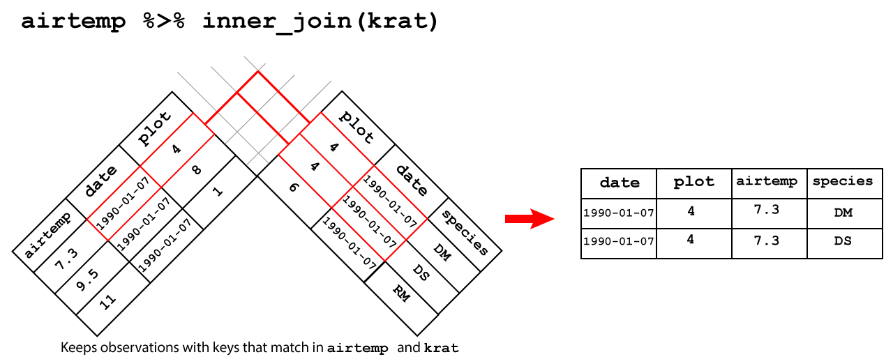
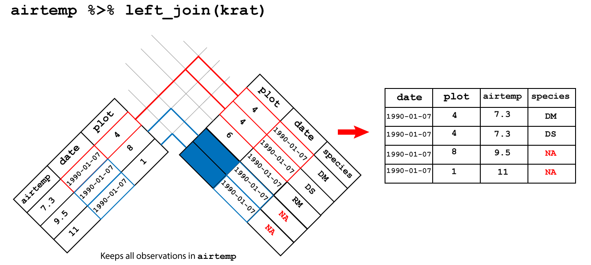
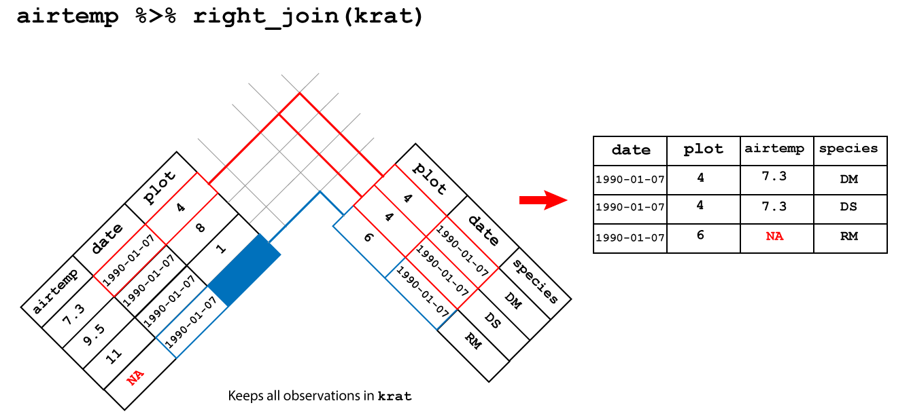
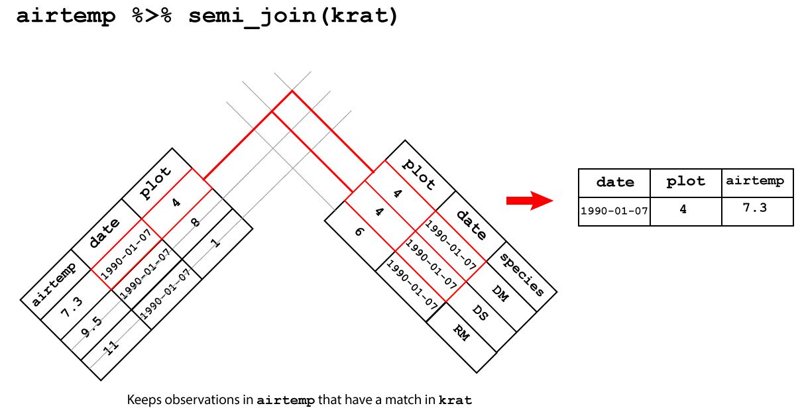

# Data wrangling II {#data-wrangle-2}

Following on from chapter 2 this lesson deals with some 
common tidying problems with data using the [`tidyr` package](https://tidyr.tidyverse.org/) . By the end of this chapter the learner 
will:

+ have learnt how to transform rows and columns to reorganise data
+ have learnt some ways to deal with missing values
+ have learnt how to join data contained in separate tables into a single table 

## Reshaping data with pivots

As you will recall [tidy data](tidy-data) means that in a table:

1. Every variable has its own column.
2. Every observation has its own row.
3. Each value has its own cell.

Two common problems making your data untidy are that:

1. A single variable is spread across multiple colummns.
2. A single observation is distributed across multiple rows.

In the first case the column names are actually the variable we are 
interested in, making our table **wide**. 

In the second case, the observation is contained in several rows instead
of a single row, making our table **long**.

Hence `tidyr` has functions that **pivot** (as in turning) a table from **wide-to-long** by reducing the number of columns and increasing the number of rows. Or from **long-to-wide** by reducing the number of rows and increasing the number of columns.

Usually, the hard part is identifying in a dataset our variables and our 
observations, as it is not always obvious which is which.

### `tidyr::pivot_longer`

First we'll consider the case when our variable has been recorded as 
column names by returning to a version of the [Portal surveys data](portal-project). 

A table containing the mean weight of 10 rodent species on each plot from the rodent survey data 
can be read directly into a `surveys_spread` object using the code below.

```{r surveys-spread, eval=FALSE}
surveys_spread <- read_csv("https://raw.githubusercontent.com/ab604/ab604.github.io/master/docs/surveys_spread.csv")
```

Feel free to explore the data, and snapshot is shown in Figure \@ref(fig:pivot-long).

Imagine that we recorded the mean weight of each rodent species on a plot in the field. 
It makes sense to put the species as column headings, along with the plot id and
then record the values in each cell.

However, really our variables of interest are the rodent species and our observational
units, the rows, should contain the mean weight for a rodent species in a plot. Hence we
need to reduce the number of columns and create a longer table.

To do this we `pivot_longer()` by using `names_to = "genus"` to create a new `genus`
variable for the exisiting column heading, and `values_to = "mean_weight"` to create
a variable `mean_weight` for the values. We put a minus sign before the 
variable `-plot_id` to tell the function not to use these values in the new variable column. 

(ref:pivl) `tidyr::pivot_longer` The genus of the rodents have been used as column headings for the weights of each animal. By creating new variables `genus` which takes the column names, and another variable `mean_weight` which takes the cell values, and but not the `plot_id` column we pivot from a wide table to a long table.

```{r pivot-long, fig.cap='(ref:pivl)',fig.asp=1, out.width = '100%', fig.align='center', echo=FALSE,cache=TRUE}
knitr::include_graphics("img/pivot_longer_R.png")
```


```{r wide-to-long}
surveys_spread %>% 
        pivot_longer(names_to = "genus", values_to = "mean_weight", -plot_id) 
```

### `tidyr::pivot_wider`

If we wanted to go the other way, from wide to long, then we need to take values
from a single column to become variables names of multiple columns, populated 
with values from an existing variable.

A version of the wide table in Figure \@ref(fig:pivot-wider) can be downloaded
into our environment and assigned as `surveys_gw` as before.

(ref:pivw) `tidyr::pivot_wider` From long table `surveys_gw` the `genus` column contains the values that become variables using `names_from` and the `mean_weight` column contains the values that fill the new columns using `values_from` in the pivot from long to wide.

```{r surveys-gw, eval=FALSE}
surveys_gw <- read_csv("https://raw.githubusercontent.com/ab604/ab604.github.io/master/docs/surveys_grouped_weight.csv")
```

This time we use `pivot_wider()` with the arguments `names_from` for the column
we want to use to create variables, and `values_from` for the column
whose values we want populate our new variable columns with.

```{r pivot-wider, fig.cap='(ref:pivw)' ,fig.asp=1,out.width = '100%', fig.align='center', echo=FALSE,cache=TRUE}
knitr::include_graphics("img/pivot_wider_R.png")
```

```{r long-to-wide}
surveys_gw %>% 
        pivot_wider(names_from = genus, values_from = mean_weight) 
```

## Missing values 

In R missing values are represented as `NA` (or `NaN` for an undefined mathematical
operation such as dividing by zero).

As discussed in [R4DS](https://r4ds.had.co.nz/tidy-data.html#missing-values-3) values can be missing in two ways:

+ **Explicitly**, i.e. flagged with NA.
+ **Implicitly**, i.e. simply not present in the data.

If we had a subset of the surveys data that looked like this table:

```{r surveys-missing, cache=TRUE}
# Create a table with missing values
surveys_ms <- tibble(year = c(1991,1991,1991,1991,1992,1992,1992),
                     qtr = c(1,2,3,4,1,2,4),
                     mean_weight = c(3.75,2.50,NA,8.50,7.50,2.25,2.50))

surveys_ms
```

Then we can see that in the third quarter of 1991, no data was recorded by the 
explicit `NA` value. However the third quarter of 1992 is missing altogether,
hence it is *implicitly* missing. 

Another issue is that explicit missing values
are often recorded in real data in various ways e.g. an empty cell or as a dash.
We can't cover all cases, but the general advice is to do some manual inspection
of your data in addition to using R to understand how missing values have been 
recorded if there are any. In an ideal world data comes with a "code book" that
explains the data, but this often doesn't happen. 
Functions such as `read_csv()` allow you to 
supply a vector of values representing `NA` which will convert these values in 
your input to `NA`s.

Once you have identified missing values, in general there two ways to deal with them: 

1. Drop incomplete observations
2. Complete the missing observations: fill or impute values.

See also [`tidyr` functions for missing values](https://tidyr.tidyverse.org/reference/index.html#section-missing-values).
 
### Checking for explicit missing values using R {#find-na}

In addition to manual inspection, one way to check for explicit missing 
values coded as `NA` in your data frame is to use the `is.na()` function which
returns a logical `TRUE` or `FALSE` vector of values.

Using this to check a single variable could be done by combining it with `select()`
for example using `surveys_ms`:

```{r select_na, cache=TRUE}
surveys_ms %>% 
        select(mean_weight) %>% 
        is.na()
```

Or with `filter()` to return the row where there is a missing value
for `mean_weight`.

```{r filter_na, cache=F}
surveys_ms %>% 
        filter(is.na(mean_weight) == TRUE)
```

A more complicated use would be to combine `is.na()` with another function such
`sum()` to provide the total number of missing values for a variable, or to 
combine `sum()` with `complete.cases()` to check each row for for missing values.

For example, to find the number of observations (rows) in `surveys` with no missing values:

```{r complete-cases, cache=TRUE}
sum(complete.cases(surveys))
```

And for a single variable, we could extend our use of `select`:

```{r select_sum_na, cache=TRUE}
surveys_ms %>% 
        select(mean_weight) %>% 
        is.na() %>% 
        sum()
```

Extending this find the missing values per variable in a whole data frame 
requires introducing more syntax and the use of a map function from the `purr` 
package. (Base R can also do this, but we're staying in the tidyverse where possible). 

The idea here is that we want to do the same calculation *mapped* across each
variable. The calculation here being count the number of missing values in each
column.

We pipe `surveys` to the `map_dfr()` function where `dfr` means return a data frame.
The `~` represents formula, meaning *"depends upon"*, such that  `sum(is.na(.))` where `.` 
represents the input variable, depends upon the variables in `surveys`. 
The map function then does this for each variable in the `surveys` dataframe 
and returns the output as a data frame. I've piped the output to `glimpse()` for 
readability.

In words what this syntax is saying is **"take the surveys dataframe and for 
each column check if each value is `NA`, then sum the number of `NA`s in each
column and return the totals for all the columns as a dataframe."**

This is pretty complicated if you've never seen this before, but hopefully you 
can follow the idea.

This could be combined with `filter()` or `select()` prior to the map function
if you wanted to subset the data further for example.

See [R4DS map functions](https://r4ds.had.co.nz/iteration.html#the-map-functions)
for more details.

```{r map_na, cache=TRUE}
surveys %>% 
        map_dfr(~ sum(is.na(.))) %>% 
        glimpse()
```

As we might expect the missing values are all for variables that record measurements
for the rodents.

### Dropping missing values

The simplest solution to observations with missing values is to drop those 
from the data set. If it makes sense to do this, then `tidyr::drop_na()` makes
it easy to do this. **Note:** This will create implicit missing values.

In Section \@ref(find-na) we found 30,676 rows with no missing values
by using `complete.cases()` on the `surveys` data of 34,786 observations.

Therefore we expect passing `surveys` to `drop_na()` will return a dataframe
of 30,676 observations:

```{r drop-na, cache=TRUE}
surveys %>% 
        drop_na() %>% 
        glimpse()
```
 
 `drop_na()` can accept variables arguments, meaning only the observations with
 missing values in those columns will be dropped. 
 
For example, here we drop only missing `weight` observations, so the rows which
have missing values for `hindfoot_length` or `sex` are kept.
 
```{r drop-weight, cache=TRUE}
surveys %>% 
        drop_na(weight) %>% 
        glimpse()
```

### Completing missing values

There are numerous ways to complete missing values, but what they generally
have in common is the approach of guessing the missing value based on existing information, otherwise known as [imputation](https://en.wikipedia.org/wiki/Imputation_(statistics)).
Here we'll cover a couple of ways to do it with `dplyr` and `tidyr` functions.

First, let's deal with implicit missing values using `tidyr::complete()`.

Imagine we have the table `surveys_ms` which is missing the value 
for the `mean_weight` for the third quarter of 1991 and all observations
for the third quarter of 1992:

```{r}
surveys_ms
```

To add the row for the third quarter of 1992 we use `complete()` with the 
`year` and `qtr` variables as arguments. The function finds all the unique
combinations of `year` and `qtr` and then adds any that are missing to create
a complete set of observations for 1991 and 1992 with explicit missing values.

```{r tidyr-complete, cache=TRUE}
surveys_ms %>% 
        complete(year,qtr)
```

Next let's consider a complete table `surveys_ic` with an explicit missing value for
the `species_id`. 

```{r surveys-ic}
surveys_ic <- tibble(species_id = c("DM","DM",NA,"DS","DS","DS"),
                     mean_weight = c(3.75,2.50,8.50,7.50,5.50,2.50))
surveys_ic
```

In this case we might reasonably assume that the missing value is `DM` as we
have six observations on two species.

We can use `tidyr::fill()` to replace `NA` with the last non-missing value for
`species_id`. This is also known as last observation carried forward.

Passing `species_id` to `fill()` completes the table:

```{r tidyr-fill, cache=TRUE}
surveys_ic %>% 
        fill(species_id)
```

Another common strategy is to impute missing values by using the mean or the
median of exisiting values for the same variable.

We can do that using [`dplyr::coalesce()`](https://dplyr.tidyverse.org/reference/coalesce.html) which is a function that finds the 
first non-missing value in a variable and then replaces it using the second
argument.

For example, if we return to `surveys_ms` we used `complete()` to complete
the observations, but we have two `NA`s in the `mean_weight` column.

Let's impute the missing values bt using the median value for `mean_weight` to
replace the `NA` values.

We can `mutate()` to overwrite the `mean_weight` variable (be careful when 
you do this!) using `coalesce()` with `mean_weight` as the first argument to look
for missing values, and then the `median()` function is used to replace the missing
values with the median `mean_weight`, remembering to remove `NA`.

```{r dplyr-coalesce, cache=TRUE}
surveys_ms %>% 
        complete(year,qtr) %>% 
        mutate(mean_weight = coalesce(mean_weight, 
                                      median(mean_weight, na.rm = TRUE)))
```

This gives us a complete table with . Whether it makes sense to do this is another
question, and you should think carefully about your missing value strategy as it
will influence your final output and conclusions.

Let's repeat part of the analysis we did to find the `mean_weight`, and now 
`mean_hindfoot`, for the full `surveys` dataset, but this time we'll 
complete the table by imputing values and compare the result to the result when 
we drop the observations with missing values.

For simplicity, let's just look at kangaroo rats. Here I introduce the `%in%`
operator with filter and vector containing the `species_id` for the kangaroo
rats. 

This leaves 16,127 observations.

```{r krats, cache=TRUE}
krats <- surveys %>% 
        filter(species_id %in% c("DM","DS","DO"))

krats %>% glimpse()
```

How many missing values are there in `krats` and for which variables?

```{r krats-missing}
# How many missing values
krats %>% map_dfr(~ sum(is.na(.))) %>% glimpse()
```

Grouping by `species_id` and `sex`, find the `mean_weight` and `mean_hindfoot` when observations with missing values are dropped:

```{r mean-drop-krats, cache=TRUE}
krats %>% drop_na() %>% group_by(species_id,sex) %>% 
        summarise(mean_weight = mean(weight), 
                  mean_hindfoot = mean(hindfoot_length))
```

Now we complete the table, first using `fill()` to impute the missing `sex` of
each kangaroo rat based on the last non-missing sex observation. Then we group
the kangaroo rats according to species and sex. Then we impute the missing `weight`
and `hindfoot_length` values with `mutate()` and `coalesce()` from each groups median
value. Finally we summarise again to find the `mean_weight` and `mean_hindfoot`
for each group.

```{r mean-impute-krats, cache=TRUE}
krats %>% 
        fill(sex) %>% 
        group_by(species_id,sex) %>% 
        mutate(weight = coalesce(weight, median(weight, na.rm = TRUE)),
               hindfoot_length = coalesce(hindfoot_length, 
                                          median(hindfoot_length, na.rm = TRUE))) %>%
        summarise(mean_weight = mean(weight),
                  mean_hindfoot = mean(hindfoot_length))
```

The results are very similar.

## Joining tables

See also [R4DS Relational data chapter](https://r4ds.had.co.nz/relational-data.html)

Previously we've used data from the [Portal project](portal-project) where
everything we needed was already contained within a single table, but often
we have *related* information spread across multiples tables that we want to analyse. 
In these situations we need to join pairs of tables to explore relationships of interest.

We'll use a dummy dataset here that recreates part of the data the Portal project
collects. As well as the animal census they separately record weather information.

Imagine we had two small tables, one called `airtemp` that contains the air temperature
in Celsius for three plots for one timepoint on one day. And another called `krat`
that records the observations for three plots on the same day for kangaroo rat
speciecs `DM`, `DS` and `RM`.

```{r one-week-data, cache=TRUE}
airtemp <- tibble(date = date(c('1990-01-07','1990-01-07','1990-01-07')),
               plot = c(4,8,1),
               airtemp = c(7.3,9.5,11))

krat <- tibble(date = date(c('1990-01-07','1990-01-07','1990-01-07')),
               plot = c(4,4,6),
               species = c("DM","DS","RM"))
```

```{r one-week-glimpse}
airtemp %>% glimpse()
krat %>% glimpse()
```

We can think of three types of join, two of which correspond with `dplyr` verbs:

1. Joins that **mutate** the table. These are joins that create a new variable in one table using
observations from another.
2. Joins that **filter** the table. These are joins that keep only a subset of observations from 
one table based on whether they match the observations in another.
3. Joins that perform **set operations**. These are joins corresponding with the 
mathematical operation of intersection $\cap$, union $\cup$, and difference $-$.

> **Note** Joins always use two tables. To add a third relationship it would 
require joining the table created from the first join to another table. And so on.

### Keys

A key is a variable or set of variables that uniquely identifies an observation
in a table. In a simple case only one variable is sufficient, but often several variables
are required.

+ Primary key: a key that uniquely identifies the observation in its own table 
e.g. the combination of `date` and `plot` is unique to each set of observations in the `airtemp` table. 
+ Foreign key: a key that uniquely identifies the observation in another table. 
e.g. the combination of `date`, `plot` and `species` is unique to each set of observations in the `krat` table.

```{r find-keys}
airtemp %>% count(date,plot)
krat %>% count(date,plot,species)
```

So joining `airtemp` and `krat` uses the `airtemp` primary key of `date` and `plot`.

Keys can be both primary and foreign, as they might be primary for one table and foreign in another or vice versa. 

It's a good idea to verify a key is primary i.e. uniquely identifies an observation.
See the examples in [R4DS keys](https://r4ds.had.co.nz/relational-data.html#keys)

If you discover your table lacks a primary key you can add one with `mutate()`.

Keys are called explicity using `by =` followed by the keys as a character vector.
For example, here we call `by = c("plot","date)`.

```{r explicit-inner}
airtemp %>% inner_join(krat, by = c("plot","date"))
```

If we implicitly let the join function choose the keys, we get an output telling
us what was used.

If we had a key that had a different name in both tables, we tell the join
function that they are the same key by saying one variable is equal to another.
For example if we had `plot` in one table and it was called `plot_id` in another,
we could use `by = c("plot" = "plot_id")` to tell the join function that this is the key.

### Mutating joins

These are joins that created new columns, hence they act like `dplyr::mutate`. 

From `dplyr` we have:

+ `inner_join()` : keeps only the observations with matching keys in both tables
+ `left_join()` : keeps all the observations in the left hand table 
+ `right_join()` : keeps all the observations in the right hand tables
+ `full_join()` : keeps all the observations in both tables

#### Inner join

> `inner_join()` : keeps only the observations with matching keys in both tables

An inner join between `airtemp` and `krat` keeps only the observations which 
have match in both tables using the primary key of `date` and `plot` as shown 
in Figure \@ref(fig:inner-join-fig).

(ref:inner-join-fig) Inner join

```{r inner-join-fig,fig.cap='(ref:inner-join-fig)',fig.asp=1,out.width = '100%', fig.align='center', echo=FALSE,cache=TRUE}

```


```{r inner-join, cache=TRUE}
airtemp %>% inner_join(krat)
```

#### Left join

> `left_join()` : keeps all the observations in the left hand table 

An left join between `airtemp` and `krat` keeps all the observations in
`airtemp` and fills the missing observations in `species` with `NA` as shown 
in Figure \@ref(fig:ljf).

(ref:left-join-fig) Left join

```{r ljf,fig.cap='(ref:left-join-fig)',fig.asp=1,out.width = '100%', fig.align='center', echo=FALSE,cache=TRUE}

```


```{r left-join, cache=T}
airtemp %>% left_join(krat)
```

#### Right join

> `right_join()` : keeps all the observations in the right hand tables

An right join between `airtemp` and `krat` keeps all the observations in
`krat` and fills the missing observations in `airtemp` with `NA` as shown in 
Figure \@ref(fig:right-join-fig).

(ref:right-join-fig) Right join

```{r right-join-fig,fig.cap='(ref:right-join-fig)',fig.asp=1,out.width = '100%', fig.align='center', echo=FALSE,cache=TRUE}

```

```{r right-join, cache=TRUE}
airtemp %>% right_join(krat)
```
#### Full join

> `full_join()` : keeps all the observations in both tables

An full join between `airtemp` and `krat` keeps all the observations in
both tables and fills the missing observations in `airtemp` and `species` with `NA` as shown in 
Figure \@ref(fig:full-join-fig).

(ref:full-join-fig) Full join

```{r full-join-fig,fig.cap='(ref:full-join-fig)',fig.asp=1,out.width = '100%', fig.align='center', echo=FALSE,cache=TRUE}

```

```{r full-join, cache=TRUE}
airtemp %>% full_join(krat)
```

### Filtering joins

Filtering joins act like the `filter` function keeping only observations
that match the join without adding or removing columns.

`semi_join()` and `anti_join()`

#### Semi join

> `semi_join()` keeps only the observations in the left hand table that
have a match in the right hand table.

A semi-join between between `airtemp` and `krat` keeps only the observation
in `airtemp` that matches in `krat` as showin in Figure \@ref(fig:semi-join-fig).

(ref:semi-join-fig) Semi join

```{r semi-join-fig,fig.cap='(ref:semi-join-fig)',fig.asp=1,out.width = '100%', fig.align='center', echo=FALSE, cache=TRUE}

```

```{r semi-join, cache=T}
airtemp %>% semi_join(krat)
```

#### Anti join

> `anti_join()` drops the observations in the left hand table that
have a match in the right hand table.

A anti-join between between `airtemp` and `krat` drops the observations
in `airtemp` that match in `krat` as shown in 
Figure \@ref(fig:anti-join-fig).

(ref:anti-join-fig) Anti join

```{r anti-join-fig,fig.cap='(ref:anti-join-fig)',fig.asp=1,out.width = '100%', fig.align='center', echo=FALSE, cache=TRUE}
knitr::include_graphics("img/anti_join.png")
```

```{r ant-join, cache=TRUE}
airtemp %>% anti_join(krat)

```

### Set operations

These are joins corresponding with the 
mathematical operation of intersection $\cap$, union $\cup$, and difference $-$ 
as shown in Figure \@ref(fig:set-operations). These are `intersect()`, `union()`
and `setdiff()`.

See [R4DS set operations](https://r4ds.had.co.nz/relational-data.html#set-operations)
for examples of usage.

(ref:set-ops) Set operations `intersect(A,B)`, `union(A,B)` and `setdiff(A,B)`.

```{r set-operations,fig.cap='(ref:set-ops)', fig.align='center',out.width = '50%', echo=FALSE, cache=TRUE}

```


### Duplicate keys

If we have duplicate keys in each tables which aren't used as part of the join, then
the join will create columns for both varaibles. For example, if we join `airtemp`
with `krat` only using `plot` as a key, but `date` is in both, we reuturn `date.x` and
`date.y` for `airtemp` and `krat` respecitively:

```{r dup-keys}
airtemp %>% full_join(krat, by = "plot")
```


### Binding rows and columns

We can also join tables by binding rows or columns. Binding rows is useful when we have
tables with different sets of observations for the same variables, such as
when we have multiple replicates of an experiment. Binding columns can be done
when we want to add a column from one table that corresponds with the observations in
another.

See [`dplyr bind`](https://dplyr.tidyverse.org/reference/bind.html) :

*"When row-binding, columns are matched by name, and any missing columns will be filled with NA."* 

*When column-binding, rows are matched by position, so all data frames must have the same number of rows."*

These functions are `bind_rows` and `bind_cols`.