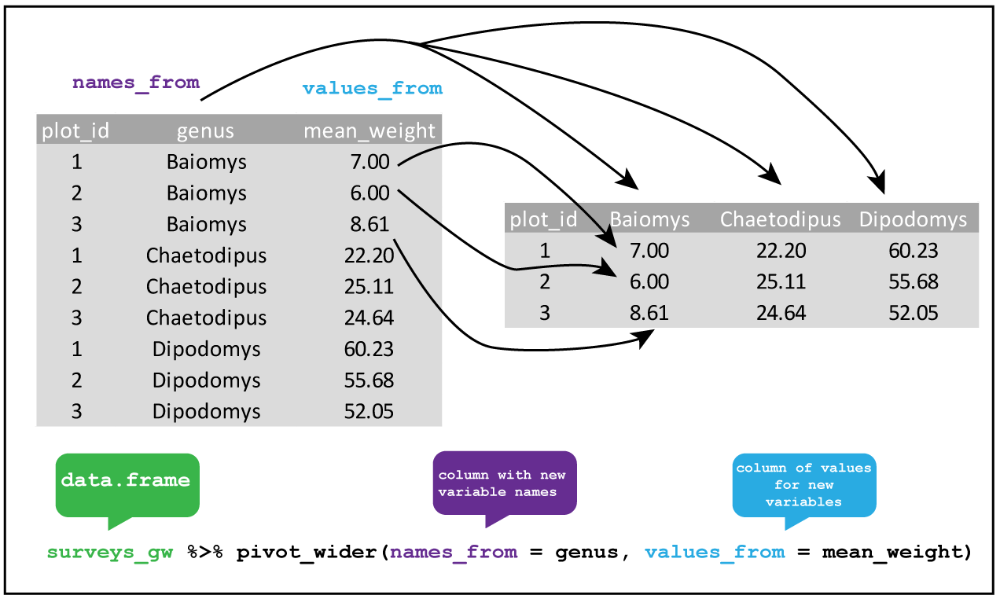

# Data wrangling II {#data-wrangle-2}

Following on from chapter 2 this lesson deals with some 
common tidying problems with data using the [`tidyr` package](https://tidyr.tidyverse.org/) . By the end of this chapter the learner 
will:

+ have learnt how to transform rows and columns to reorganise data
+ have learnt how to join data contained in separate tables into a single table 
+ have learnt some ways to deal with missing values

## Reshaping data with pivots

As you will recall [tidy data](tidy-data) means that in a table:

1. Every variable has its own column.
2. Every observation has its own row.
3. Each value has its own cell.

Two common problems making your data untidy are that:

1. A single variable is spread across multiple colummns.
2. A single observation is distributed across multiple rows.

In the first case the column names are actually the variable we are 
interested in, making our table **wide**. 

In the second case, the observation is contained in several rows instead
of a single row, making our table **long**.

Hence `tidyr` has functions that **pivot** (as in turning) a table from **wide-to-long** by reducing the number of columns and increasing the number of rows. Or from **long-to-wide** by reducing the number of rows and increasing the number of columns.

Usually, the hard part is identifying in a dataset our variables and our 
observations, as it is not always obvious which is which.

### `tidyr::pivot_longer`

First we'll consider the case when our variable has been recorded as 
column names by returning to a version of the [Portal surveys data](portal-project). 

A table containing the mean weight of 10 rodent species on each plot from the rodent survey data 
can be read directly into a `surveys_spread` object using the code below.

```{r surveys-spread, eval=FALSE}
surveys_spread <- read_csv("https://raw.githubusercontent.com/ab604/ab604.github.io/master/docs/surveys_spread.csv")
```

Feel free to explore the data, and snapshot is shown in Figure \@ref(fig:pivot-long).

Imagine that we recorded the mean weight of each rodent species on a plot in the field. 
It makes sense to put the species as column headings, along with the plot id and
then record the values in each cell.

However, really our variables of interest are the rodent species and our observational
units, the rows, should contain the mean weight for a rodent species in a plot. Hence we
need to reduce the number of columns and create a longer table.

To do this we `pivot_longer()` by using `names_to = "genus"` to create a new `genus`
variable for the exisiting column heading, and `values_to = "mean_weight"` to create
a variable `mean_weight` for the values. We put a minus sign before the 
variable `-plot_id` to tell the function not to use these values in the new variable column. 

(ref:pivl) `tidyr::pivot_longer`

```{r pivot-long, fig.cap='(ref:pivl)',fig.asp=1, out.width = '100%', fig.align='center', echo=FALSE,cache=TRUE}
knitr::include_graphics("img/pivot_longer_R.png")
```


```{r wide-to-long}
surveys_spread %>% 
        pivot_longer(names_to = "genus", values_to = "mean_weight", -plot_id) 
```

### `tidyr::pivot_wider`

(ref:pivw) `tidyr::pivot_wider`

```{r surveys-gw, eval=FALSE}
surveys_gw <- read_csv("https://raw.githubusercontent.com/ab604/ab604.github.io/master/docs/surveys_grouped_weight.csv")
```


```{r pivot-wider, fig.cap='(ref:pivw)' ,fig.asp=1,out.width = '100%', fig.align='center', echo=FALSE,cache=TRUE}

```


```{r long-to-wide}
surveys_gw %>% 
        pivot_wider(names_from = genus, values_from = mean_weight) 
```


<!--  ## Missing values 

As discussed in [R4DS](https://r4ds.had.co.nz/tidy-data.html#missing-values-3) values can be missing in two ways:

+ **Explicitly**, i.e. flagged with NA.
+ **Implicitly**, i.e. simply not present in the data.

## Joining tables

Species
Portal_rodent_species contains the species codes used in Portal_rodent. Any animal found in a trap is recorded. Non-rodent species are occasionally trapped and so are given species codes. Several columns are also included in the species table to restrict the species list to only rodents, only target species, or only granivores.

Rodent adundance data
Portal_rodent contains the rodent trapping data. Each individual of a target species is PIT tagged and data on species, location caught (plot and stake), sex, reproductive condition, weight, and hindfoot length are recorded. In almost all cases, you will want to remove negative period codes before using this data. Negative period codes indicate data collected outside of the normal census protocols, and should absolutely not be used as regular trapping data.

```{r, cache=TRUE,eval=TRUE}
rodent_species <- read_csv("https://raw.githubusercontent.com/weecology/PortalData/master/Rodents/Portal_rodent_species.csv")
# 
rodent_data <-  read_csv("https://raw.githubusercontent.com/weecology/PortalData/master/Rodents/Portal_rodent.csv",
                         col_types = cols(tag = col_character(),
                                         prevrt = col_character(),
                                         ltag = col_character(),
                                         note2 = col_character(),
                                         note3 = col_character(), 
                                         note4 = col_character(), 
                                         note5 = col_character()))
```

```{r inner-join}
rodent_species %>% left_join(rodent_data, by = c("speciescode" = "species"))
```
-->
