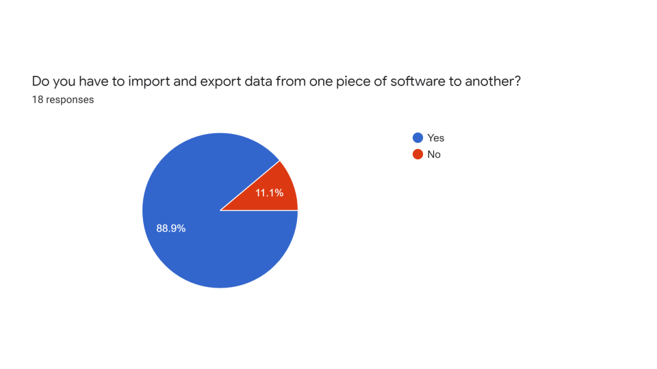
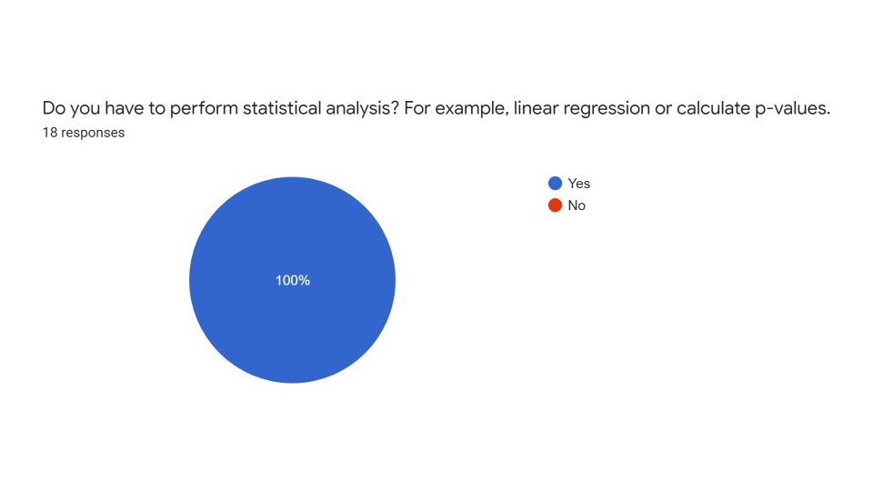
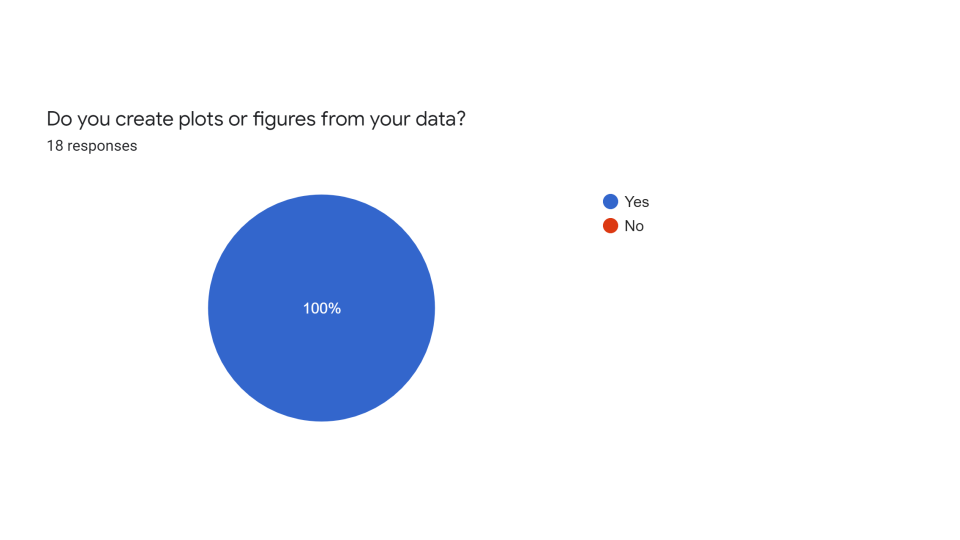
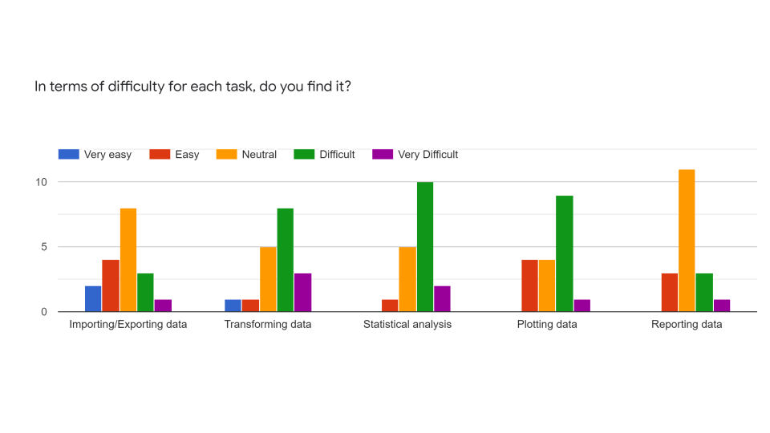
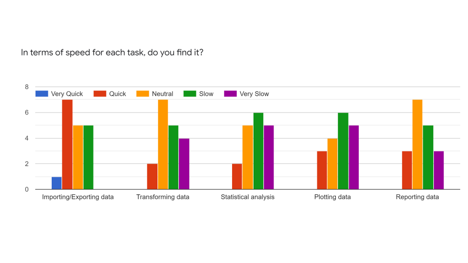
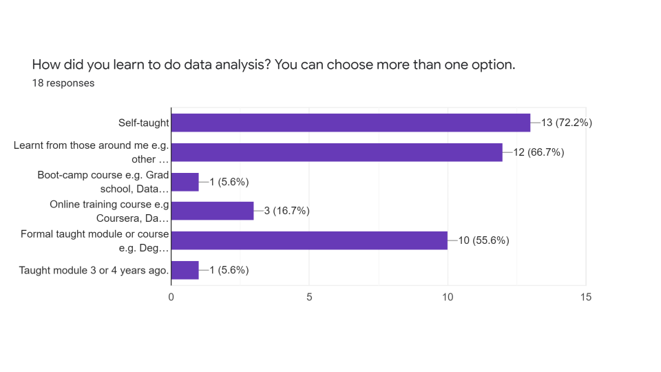
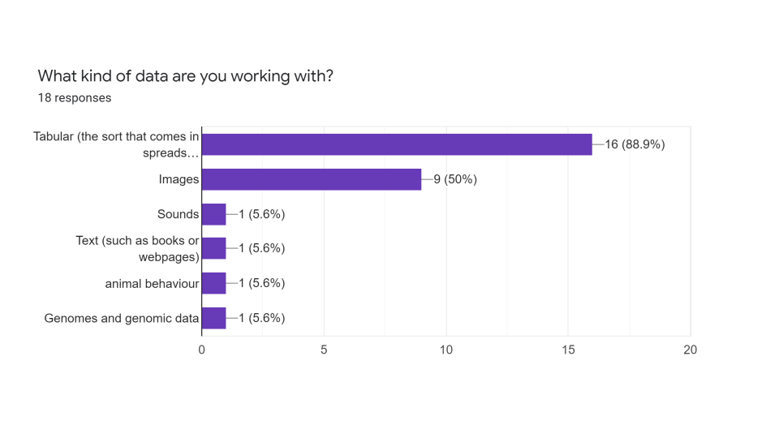
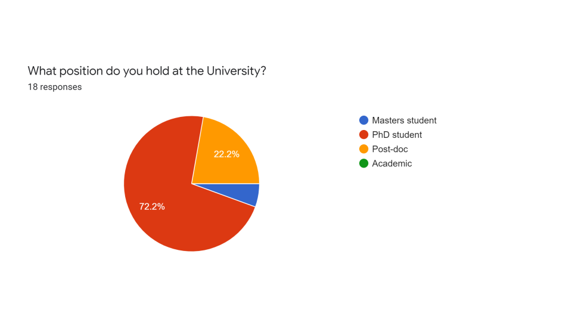
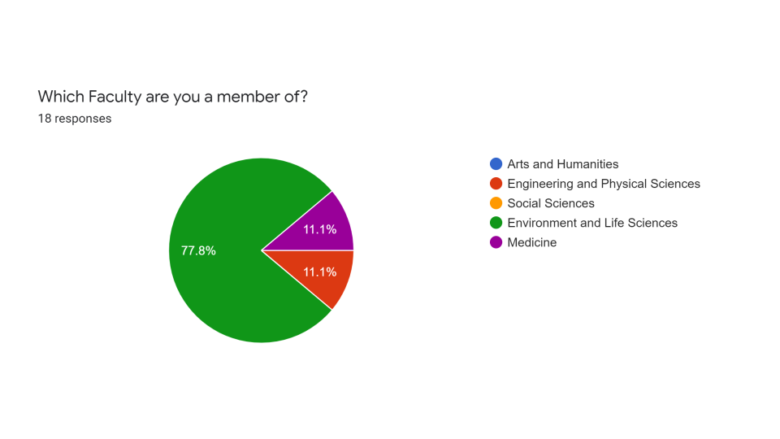

```{r setup, include=FALSE}
knitr::opts_chunk$set(echo = FALSE, message = FALSE)
library(tidyverse)
library(lubridate)
library(glue)
library(scales)
library(janitor)
library(here)
library(patchwork)
```

## Summary and reflections

[Coding togetheR](https://ab604.github.io/docs/coding-together-2019/) was run as 
a series of two hour workshops based on my experiences of working as a member of [The Carpentries](https://carpentries.org/) community, as a member of the global R community,
and as the name suggests from reading Greg Wilson's [Teaching Tech Together](https://teachtogether.tech/#).
There were seven workshops weekly from the 10th October 2019 until the 21st November, 
and then there
were two further workshops on the 9th and 16th of January. (We had a break during the industrial action.)

The course was intended to be open to 20 learners from across the University, but
after opening application on a first come, first serve basis to those on the Life Sciences
mailing list, the course was filled within an hour of advertisement by 
learners almost exclusively from Biological Sciences and Medicine, including three 
additional learners to the original 20, making a total of 23 learners registered.

The aim of the workshops was to provide a question driven introduction to working 
with tabular data in R by introducing:

+ the R language in the RStudio interactive development environment.
+ how to organise analysis into a workflow.
+ how to import and export data and how the atomic data types are represented in R.
+ data transformation using R.
+ visualising data using R.

As measured by the number of workshop survey respondents, 
the workshops began with 23 learners and finished with 8 learners. A 65% attrition rate, 
worse than my prediction of 50%.  
Despite my best intentions, and as a result of my fairly poor attempts to recruit others, the workshops were led exclusively by me in contradiction of the
["never teach alone"](https://teachtogether.tech/) rule. It's speculation, but this may
in part account for the higher than expected attrition rate, as additional teachers
and teaching assistants would, in my opinion, have improved the learning experience. 
Having a number of teachers is certainly one of the best things about a Carpentries workshop 
in terms of creating a fun atmosphere and feeding back to each other within the workshop about
what is working and not working so well.

Prior to the workshops I also asked the learners to complete a survey designed
to indicate their needs in order to help me align the lessons accordingly. The results
are below in the [data skills survey](#data-survey) section.

The primary motivation for these workshops is from my own experience as someone
who in 2015 didn't identify as someone who coded, but realised that I needed to learn to
better data analysis skills in order to successfully do my research, and in a more efficient 
and reproducible way. Through an introduction to the R
community via [Simply Statistics](https://simplystatistics.org/),
I discovered that coding met that unmet need. I subsequently observed that there 
are other people in my immediate environment in similar positions to myself, 
struggling with their data, but unsure of how
to get started. This observation led me to join the Carpentries community and my involvement
with the [Research Software Group](https://rsgsoton.net/) in Southampton. 
In the last decade there has been an explosion of free availability of materials
for teaching coding and data analysis in R and Python: The Carpentries, [R for Data Science](https://r4ds.had.co.nz/),
[Tidy Tuesdays](https://github.com/rfordatascience/tidytuesday), and Teaching Tech Together to name a few. 
Hence [the materials I've put together](https://ab604.github.io/docs/coding-together-2019/) largely draw from these existing materials,
and there exist far more materials than can be covered in nine two hour sessions.

The hypothesis I've formulated is that there exists a large cohort of people - not just
researchers and students, but also administrators and others - within 
the University of Southampton who don't identify as coders, but who actually do
code informally through their use of Excel, Graphpad and other software, who would
benefit from some foundational coding skills if given the opportunity to learn, and 
that these skills were taught from the stance of *"What do you need?"* and *"Let's work this out together."*
rather than *"You should learn this."* or *"People who use Excel are idiots."*. 
Moreover that anyone who would like to learn these foundational skills should be
do so within the University. I'm not sure what Universities think they are for any more,
but I'd like to think there is still room for just helping each other and doing things
because they are intrinsically worthwhile, rather for than money, metrics or prestige. 
I've not been able to test my hypothesis yet, let alone 
demonstrate anything concrete that would convince those with power and money to invest in these ideas,
but this was very much starting where I am, with what we have and who is around me, 
in order to take the first step in understanding what we should be doing. I would
still very much like to do a proper face-to-face [data skills survey](#data-survey) of a representative sample of
people across the University to assess what needs people actually have and establish
a bit of ground truth upon which to build an evidence base of what's needed and what works to meet those needs.

The motivation for creating a series of workshops was in part from the feedback received at the
Carpentries workshops I've worked on which are usually one or two intensive days, 
and learners express a desire for something with a lower cognitive load, and that
incorporates spaced repetition. Weekly workshops seem like a good way to address
that point. Secondly learners also feed back that they particularly like
live coding and style of teaching i.e. formative and summative assessments, 
and the chance to see mistakes and how to correct them in real time. (In the final 
workshop the learners spotted the missing comma was in a function when their code 
was working, but mine wasn't!).

Given the attrition rate, comparison of the anonymous pre and post-workshops surveys (see [survey results](#workshops-survey)) carried
out is not massively informative. But the data such as it is, does indicate that of 
the eight learners completing the post workshop survey, only one said they now
would not be able to use R to import, export, transform and plot data from a spreadsheet.

Qualitative feedback was in line with that received at Carpentries workshops in that
the process of writing code with others, slowly, and use of stickies to indicate when learners
are OK or not were the most useful aspects. As for improvements, there were several requests for homework so
learners could practice between sessions, as well as for a more interesting and 
wider range of data sets. Not much love for the Portal Rodent Survey, and I think I 
agree it is a rather dull data set. There was also a request for more sessions, and
one of the main things I learnt myself was that the content appropriate for two hours
is far less than I thought originally.

In seeing some of the learners back at their research since the workshops, 
I've observed difficulties in translating concepts covered in the
workshops to their own work e.g. Recognising when matching observations between
datasets requires using a join function. 
Problem recognition is ubiquitous problem in itself. My anecdotal experience of asking
researchers (including myself) at all levels from Undergraduate to Professor what the question is 
they are trying to answer, is that they struggle to provide a concise response, and this
is usually the start of an iterative process to whittle down from the general
to the specific. I don't know whether this process is something that has
a more formal approach in the context of teaching coding - ironically I couldn't figure out
how to Google it - or is just what people 
informally refer to as "experience". It could simply be that the summative 
assessments weren't actually doing what they were supposed to do in terms of
demonstrating whether I had conveyed the concepts. I think this is 
another example of why one shouldn't teach alone, and that this sort of issue 
would be more easily addressed within a group leading to better lesson design and
delivery. 

If this isn't to be the end of the line, I think the next steps require me to follow 
Greg's advice about [building relationships](https://teachtogether.tech/#s:outreach-final). 
The major caveat being that I survive in academia from one fixed term research contract to another, and 
those contracts are in large part dependent on my research results. It's only science
when I assume I don't know the answer and test my ideas to find out how wrong I am. But when
there is no obvious direct line between teaching people to code and improvements in the University
finances or rankings, I'm not optimistic that support will be forthcoming from above.
And I certainly don't want to undermine those who are paid to teach. It's all about
sharing skills in the hope it will help stop the idiots from winning.

## Coding togetheR surveys results {#workshops-survey}

```{r data, warning=FALSE}

# Set colours 
# Marine-1, Horizon-1, Horizon-3, Marine-2, Horizon-2, Horizon 5, Marine 5,Neutral 2
my_cols <- c("#005C84","#FCBC00","#E73037","#74C9E5",
             "#EF7D00","#8D3970","#4BB694","#758D9A")


pre <- read_csv("pre-workshop-survey-2020-10-18.csv")
post <- read_csv("post-workshop-survey-2020-01-24.csv")


pre_piv <- pre %>% pivot_longer(-Timestamp,names_to = "question", values_to = "answer") %>% 
        select(-Timestamp) %>% 
        filter(answer %in% c("Yes - without help","No","Yes - with documentation")) %>% 
        group_by(question) %>% mutate(q_n =group_indices()) %>% 
                                      mutate(q = glue("Q{group_indices()}")) %>% 
        ungroup() %>% 
        group_by(question, q_n,q, answer) %>% 
        summarise(n = n()) %>% mutate(freq = n/sum(n),
                                      survey = "Pre-workshop")

post_piv <- post %>% pivot_longer(-Timestamp,names_to = "question", values_to = "answer") %>% 
        select(-Timestamp) %>% mutate(survey = "B") %>% 
        filter(answer %in% c("Yes - without help","No","Yes - with documentation")) %>% 
        group_by(question) %>% mutate(q_n =group_indices()) %>% 
                                      mutate(q = glue("Q{group_indices()}")) %>% 
        ungroup() %>% 
        group_by(question, q_n,q, answer) %>%
        summarise(n = n()) %>% mutate(freq = n/sum(n),
                                      survey = "Post-workshop")

surveys <- bind_rows(pre_piv,post_piv) %>% 
        mutate(survey = fct_relevel(survey,"Pre-workshop","Post-workshop")) %>% 
        rename(Answer = answer)
```

The learners were asked these five questions before and after the workshop series:

1. Could you import data from a spreadsheet and create a new variable (column) as a function of the existing variables? For example create a new column in the table containing the mean value of three other columns?	
2. Could you import data from a spreadsheet and subset specific rows and columns from the data and assign them to a new object?
3. Could you import data from a spreadsheet and use a function to tell you number of observations (rows) and variables (columns) the data set contains?	
4. Could you import data from a spreadsheet, select two variables, and then create a plot of points to explore the relationship between these variables on an x-y axis?	
5. Would you be able to export tabular data in R to a spreadsheet, for example a csv or excel file?

```{r plot, echo= FALSE}
# Short questions

surveys %>% 
        ggplot(aes(x = survey, y = freq, fill = Answer)) +
        geom_bar(stat = "identity") +
        scale_fill_manual(values = my_cols[3:1]) +
        facet_wrap(~ q) +
        theme_minimal() +
        theme(legend.position = "bottom") +
        scale_y_continuous(labels = label_percent()) +
        labs(x = "", y = "") #+
        #theme(strip.text.x = element_blank())
        
```

## Data skills survey {#data-survey}

18 of the 23 learners responded to the data skills survey prior to the workshops
commencing.

```{r q1}

```
```{r q2}

```
```{r q3}

```
```{r q4}

```
```{r q5}

```
```{r q6}

```
```{r q7}

```
```{r q8}
knitr::include_graphics("survey-img/q8.svg")
```
```{r q9}

```
```{r q10}

```
```{r q11}

```
```{r q12}

```

