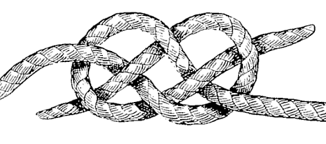

```{r include=FALSE}
library(tidyverse)
library(janitor)
library(here)
# automatically create a bib database for R packages
knitr::write_bib(c(
  .packages(), 'bookdown', 'knitr', 'rmarkdown', 'rmallet','here'
), 'bib/packages.bib')
```

# Welcome {-}

```{r knot,  fig.align='center', out.width="60%", fig.cap="[A Carrick bend.](https://en.wikipedia.org/wiki/File:Carrick-bend-Guten-Verrill-modified.png) The Carrick bend is a type of sailor's knot used for joining two lines.", echo=FALSE}

```
<!--  -->

Coding togetheR is a series of collaborative workshops to teach 
foundational R codiing and data science skills at the University of Southampton
in 2019. This book contains the materials covered over eight, two hour sessions.

The workshops are for anyone at the University of Southampton with data to analyse and who is struggling with their current tools. This series of eight weekly two hour workshops provides an introduction to working with data using R in a supported environment. Unlike traditional lessons, we all code together with the emphasis on participants learning by doing and by helping each other.

These materials are a mash-up of my own, and many others. I've endevoured to
credit everyone appropriately, but please message [me](https://ab604.uk/) if I've messed up and I'll correct it.
The main sources used here are: [r4ds](https://r4ds.had.co.nz/), [r4ds community](https://www.rfordatasci.com/), [the Carpentries](https://carpentries.org/),
[Hands on Programming in R](https://rstudio-education.github.io/hopr/) and
[Teaching Tech togetheR](http://teachtogether.tech/en/). 

It was written using R [@R-base] in RStudio 
[@rstudioteam2018] using the bookdown package [@R-bookdown].


