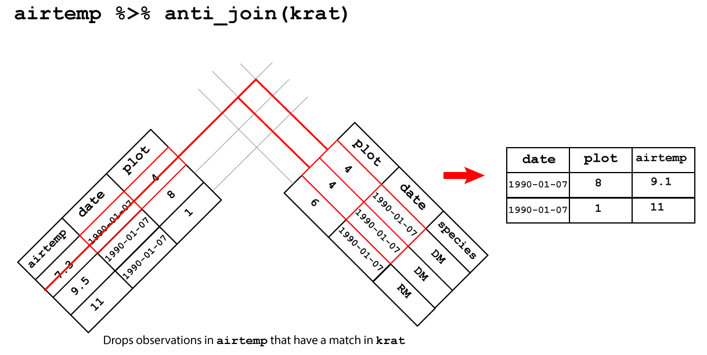
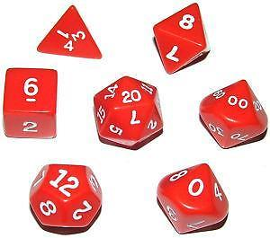

```{r knitr-options,include=FALSE}
```

## What is R? What is RStudio?

+ The term `R` is used to refer to both the programming language and the software that interprets the scripts written using it.
+ `RStudio` is an interactive development environment which as this defintion suggests assists us in using `R`

## Understanding R

*To understand computations in `R`, two slogans are helpful:*

+ *Everything that exists is an object.*
+ *Everything that happens is a function call.*

— John Chambers

## Reproducible science

*"Reproducibility involves being able to recalculate the exact
numbers in a data analysis using the code and raw data
provided by the analyst...Reproducibility should not be confused with
“correctness” of a data analysis. A data analysis can be fully
reproducible and recreate all numbers in an analysis and still
be misleading or incorrect."*

Jeff Leek, The Elements of Data Analytic Style


## Reproducible R | Don't save your workspace, save your code. Consider your scripts/notebooks as real, not the objects in your environment. 

```{r, out.width='40%', fig.align='center', fig.cap='', echo=FALSE}
knitr::include_graphics('../img/rdata_turn_off.png')
```

## Where does your data live? Absolute path


```{r, out.width='100%',fig.align='center', fig.cap='', echo=FALSE}
knitr::include_graphics("../img/abs-filepath-23-10-2019.png")
```

## Where does your data live? Relative path

```{r, out.width='100%',fig.align='center', fig.cap='', echo=FALSE}
knitr::include_graphics("../img/rel-filepath-23-10-2019.png")
```

## Where does your data live? Home directory path

```{r, out.width='100%',fig.align='center', fig.cap='', echo=FALSE}
knitr::include_graphics("../img/home-filepath-23-10-2019.png")
```

## Where does your data live? Working directory

The **working directory**. This is where R looks for files that you ask it to load

```{r, out.width='80%', fig.align='center', fig.cap='', echo=FALSE}
knitr::include_graphics('../img/R-ecology-work_dir_structure.png')
```

## Reproducible R | `R Projects` keep all the files associated with a project together — input data, R scripts, analytical results, figures. 

```{r, out.width='60%', fig.align='center', fig.cap='', echo=FALSE}
knitr::include_graphics('../img/rstudio_create_project.PNG')
```

## Naming things 

1. Machine readable (no white space, punctuation, upper AND lower-case...)
2. Human readable  (makes sense in 6 months or 2 years time)
3. Plays well with default ordering (numerical or date order)

## Getting help

- Google: *'Typically adding “R” to a query is enough to restrict it to relevant results'*. Hadley Wickham
- Check out the help pages using `?function_name` e.g. `?mean`
- Join [RStudio Community](https://community.rstudio.com/)
- Learn how to make a [reproducible example](https://www.tidyverse.org/help/)


## Assigning objects | names are labels bound to objects {.flexbox .vcenter .centered}

```{r, out.width='80%', fig.align='center', fig.cap='', echo=FALSE}
knitr::include_graphics('../img/bibi-data.png')
```

## Atomic vectors  | One-dimensional groups, the key building blocks of R objects

```{r, out.width='35%',fig.align='center', fig.cap='', echo=FALSE}
knitr::include_graphics('../img/r-vectors-07-10-2018.png')
```

## Indexing atomic vectors

```{r atomic-vector, echo=TRUE,eval=TRUE}
# Make a character vector using the combine function, c()
cards <- c("ace", "king", "queen", "jack", "ten")

# Return the values of cards
cards
```

```{r index-cards, echo=TRUE,eval=TRUE}
# Return the third value of cards
# Indexing starts at 1
cards[3]
```

## Type of atomic vectors

```{r typeof-vector, echo=TRUE,eval=TRUE}
# Make a character vector using the combine function, c()
cards <- c("ace", "king", "queen", "jack", "ten")
# Make a numeric vector using seq()
my_sequence <- seq(1:7)

# Check the type of each vector
typeof(cards)
typeof(my_sequence)
```

## Data frames | Two dimensional versions of lists, each atomic vector is the same length.  {.flexbox .vcenter .centered}

```{r, out.width='75%', fig.align='center', fig.cap='', echo=FALSE}
knitr::include_graphics('../img/data_frame.png')
```

## Tidy data

1. Each variable forms a <span style="color:red">column</span> 
2. Each observation forms a <span style="color:red">row</span>
3. Each cell contains a <span style="color:red">single value</span>

## `dplyr::filter()`

```{r, out.width='100%',fig.align='center', fig.cap='', echo=FALSE}
knitr::include_graphics("../img/dplyr_filter.png")
```

## `dplyr::arrange()`

```{r, out.width='100%', fig.align='center', fig.cap='', echo=FALSE}
knitr::include_graphics("../img/dplyr_arrange.png")
```


## `dplyr::select()`

```{r,out.width='100%',  fig.align='center', fig.cap='', echo=FALSE}

```

## `dplyr::mutate()`

```{r, out.width='100%', fig.align='center', fig.cap='', echo=FALSE}
knitr::include_graphics("../img/dplyr-mutate-16-10-2019.png")
```

## `dplyr::summraise()`

```{r, out.width='100%', fig.align='center', fig.cap='', echo=FALSE}

```

## `dplyr::summraise()` and `dplyr::group_by()`


```{r, out.width='100%', fig.align='center', fig.cap='', echo=FALSE}
knitr::include_graphics("../img/dplyr-group-by-16-10-2019.png")
```


## `dplyr::pivot_longer()`

```{r, out.width='80%', fig.align='center', fig.cap='', echo=FALSE}
knitr::include_graphics("../img/pivot_longer_R.png")
```

## `dplyr::pivot_wider()`

```{r, out.width='80%', fig.align='center', fig.cap='', echo=FALSE}
knitr::include_graphics("../img/pivot_wider_R.png")
```

## `dplyr::inner_join()`

```{r, out.width='80%', fig.align='center', fig.cap='', echo=FALSE}
knitr::include_graphics("../img/inner_join.png")
```

## `dplyr::left_join()`

```{r, out.width='80%', fig.align='center', fig.cap='', echo=FALSE}
knitr::include_graphics("../img/left_join.png")
```

## `dplyr::right_join()`

```{r, out.width='80%', fig.align='center', fig.cap='', echo=FALSE}
knitr::include_graphics("../img/right_join.png")
```

## `dplyr::full_join()`

```{r, out.width='80%', fig.align='center', fig.cap='', echo=FALSE}
knitr::include_graphics("../img/full_join.png")
```

## `dplyr::semi_join()`

```{r, out.width='80%', fig.align='center', fig.cap='', echo=FALSE}
knitr::include_graphics("../img/semi_join.png")
```

## `dplyr::anti_join()`

```{r, out.width='80%', fig.align='center', fig.cap='', echo=FALSE}

```

## 

```{r, out.width='80%',fig.align='center', fig.cap='', echo=FALSE}

```

## Functions

Name,body and set of arguments

```{r eval=FALSE, echo=TRUE}
# Roll two dice function
roll <- function(){
  die <- 1:6
  dice <- sample(die, size = 2, replace = TRUE)
  sum(dice)
}
```

```{r, out.width='25%', fig.align='center', fig.cap='', echo=FALSE}
knitr::include_graphics('../img/dice.jpg')
```

## Functions

```{r, out.width='50%', fig.align='center', fig.cap='', echo=FALSE}

```

##

```{r, out.width='100%', fig.align='center', fig.cap='', echo=FALSE}
knitr::include_graphics('../img/r-dice-function-07-10-2018.png')
```

## GDP calculator

```{r eval=FALSE, echo=TRUE}
# Takes a dataset and multiplies the population column
# with the GDP per capita column.
calcGDP <- function(dat, yr=NULL, ctry=NULL) {
  # Is there a year argument?
  if(!is.null(yr)) {
   dat <- dat %>% filter(year == yr)
  }
  # Is there a country argument?
  if (!is.null(ctry)) {
   dat <- dat %>% filter(country == ctry)
  }
  # Create new GDP column
  new <- dat %>% mutate(gdp = pop * gdpPercap)
  return(new)
}
```
